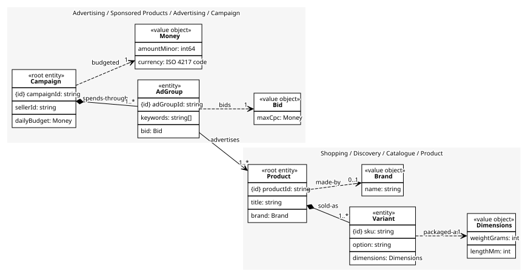
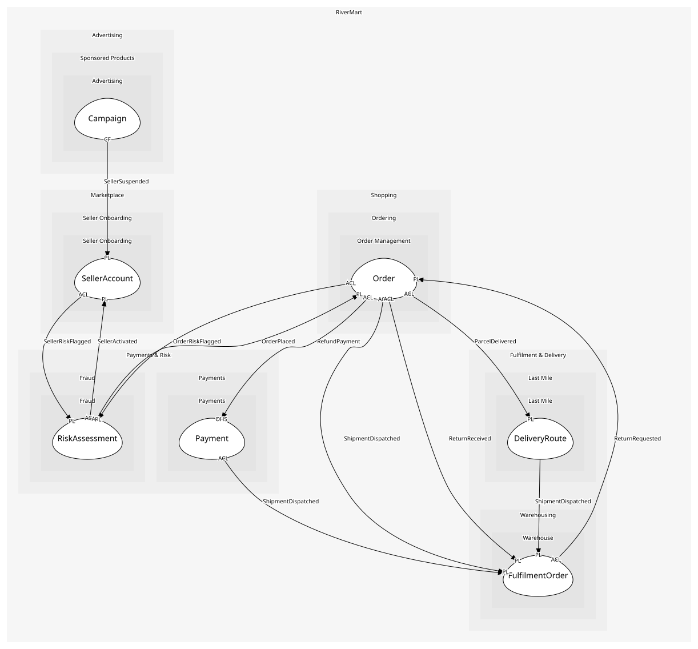

# Campaign
A seller's budget and the ad groups that spend it

## Entities and Value Objects
| Type | Name | Description | Attributes |
| --- | --- | --- | --- |
| Entity (Root) | **Campaign** | One seller's advertising plan with a daily budget | **campaignId**: `string`, sellerId: `string`, dailyBudget: `Money` |
| Entity | AdGroup | Products and keywords that share a bid | **adGroupId**: `string`, keywords: `string[]`, bid: `Bid` |
| Value Object | Money | An amount in a currency: minor units and an ISO 4217 code | amountMinor: `int64`, currency: `ISO 4217 code` |
| Value Object | Bid | What the seller pays per click, at most | maxCpc: `Money` |

## Relationships
| Source | Description | Target | Relation | Cardinality |
| --- | --- | --- | --- | --- |
| [Campaign](entities/campaign/index.md) | spends-through | Campaign - AdGroup | includes | 1..* |
| [AdGroup](entities/ad_group/index.md) | bids | Campaign - Bid | uses | 1 |
| [AdGroup](entities/ad_group/index.md) | advertises | Product - Product | references | 1..* |
| [Product](../../../catalogue/aggregates/product/entities/product/index.md) | sold-as | Product - Variant | includes | 1..* |
| [Variant](../../../catalogue/aggregates/product/entities/variant/index.md) | packaged-as | Product - Dimensions | uses | 1 |
| [Product](../../../catalogue/aggregates/product/entities/product/index.md) | made-by | Product - Brand | uses | 0..1 |
| [Campaign](entities/campaign/index.md) | budgeted | Campaign - Money | uses | 1 |

## Invariants
| Name | Description | Constrains |
| --- | --- | --- |
| BidWithinBudget | No bid exceeds the daily budget | Bid, Campaign.dailyBudget |
| BudgetPositive | A campaign with no budget cannot run | Campaign.dailyBudget |

## Provides
| Name | Type | Internal | Pattern | Description | Schema | Raises |
| --- | --- | --- | --- | --- | --- | --- |
| AdClicked | event | no | published-language | A sponsored result was clicked and the bid charged | [AdClicked](../../index.md#schemas) | - |
| CampaignLaunched | event | yes | - | A campaign began spending | - | - |
| PauseSellerCampaigns | operation | yes | - | Stop every campaign of a seller | - | - |

## Consumes

### SellerSuspended [conformist]
A seller lost the right to sell; offers and campaigns must stop
- **Provider**: [SellerAccount](../../../seller_onboarding/aggregates/seller_account/index.md)

	
