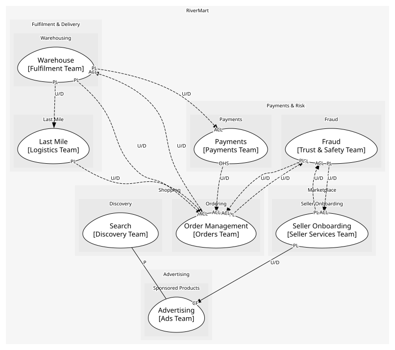
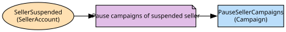

# Advertising
Seller campaigns and the auction for sponsored slots

**Owned by:** Ads Team

## Serves
- [Advertising / Sponsored Products](../../domains/advertising/subdomains/sponsored_products/index.md) (core)

## Glossary
| Term | Definition | Aliases | Embodied by |
| --- | --- | --- | --- |
| **Sponsored slot** | A results-page position sold by auction rather than earned by relevance | Sponsored Product | AuctionService |

## Aggregates

### [Campaign](aggregates/campaign/index.md)
A seller's budget and the ad groups that spend it

	
## Services

### [AuctionService](services/auction_service/index.md)
Runs the second-price auction for the sponsored slots on a results page

### [AdsAPI](services/ads_api/index.md)
Campaign management for sellers and the sponsored-results read for Search

## Schemas
| Name | Description | Attributes | Used by |
| --- | --- | --- | --- |
| AdClicked | - | **campaignId**: `string`, productId: `string`, cost: `Money` | AdClicked |

## Policies

| Name | Description | On | Then |
| --- | --- | --- | --- |
| Pause campaigns of suspended seller | A suspended seller stops spending the moment they are suspended | SellerSuspended | PauseSellerCampaigns |

## Context Relationships
| Upstream | Relationship | Downstream | Upstream Roles | Downstream Roles |
| --- | --- | --- | --- | --- |
| Seller Onboarding | upstream-downstream | Advertising | published-language | conformist |
| Search | partnership | Advertising | - | - |
| Fraud | upstream-downstream (implied) | Seller Onboarding | published-language | anti-corruption-layer |
| Order Management | upstream-downstream (implied) | Fraud | published-language | anti-corruption-layer |
| Fraud | upstream-downstream (implied) | Order Management | published-language | anti-corruption-layer |
| Warehouse | upstream-downstream (implied) | Order Management | published-language | anti-corruption-layer |
| Order Management | upstream-downstream (implied) | Warehouse | published-language | anti-corruption-layer |
| Payments | upstream-downstream (implied) | Order Management | open-host-service | anti-corruption-layer |
| Warehouse | upstream-downstream (implied) | Payments | published-language | anti-corruption-layer |
| Last Mile | upstream-downstream (implied) | Order Management | published-language | anti-corruption-layer |
| Warehouse | upstream-downstream (implied) | Last Mile | published-language | - |
| Seller Onboarding | upstream-downstream (implied) | Fraud | published-language | anti-corruption-layer |

## Consumptions
| Consumer | Consumed As | Provider | Consumable | Provided As |
| --- | --- | --- | --- | --- |
| [SearchAPI](../search/services/search_api/index.md) | conformist | AdsAPI | GetSponsoredResults | open-host-service |
| [Campaign](aggregates/campaign/index.md) | conformist | SellerAccount | SellerSuspended | published-language |
| [SellerAccount](../seller_onboarding/aggregates/seller_account/index.md) | anti-corruption-layer | RiskAssessment | SellerRiskFlagged | published-language |
| [RiskAssessment](../fraud/aggregates/risk_assessment/index.md) | anti-corruption-layer | Order | OrderPlaced | published-language |
| [Order](../order_management/aggregates/order/index.md) | anti-corruption-layer | RiskAssessment | OrderRiskFlagged | published-language |
| [Order](../order_management/aggregates/order/index.md) | anti-corruption-layer | FulfilmentOrder | ShipmentDispatched | published-language |
| [FulfilmentOrder](../warehouse/aggregates/fulfilment_order/index.md) | anti-corruption-layer | Order | ReturnRequested | published-language |
| [Order](../order_management/aggregates/order/index.md) | anti-corruption-layer | FulfilmentOrder | ReturnReceived | published-language |
| [Order](../order_management/aggregates/order/index.md) | anti-corruption-layer | Payment | RefundPayment | open-host-service |
| [Payment](../payments/aggregates/payment/index.md) | anti-corruption-layer | FulfilmentOrder | ShipmentDispatched | published-language |
| [Order](../order_management/aggregates/order/index.md) | anti-corruption-layer | DeliveryRoute | ParcelDelivered | published-language |
| [DeliveryRoute](../last_mile/aggregates/delivery_route/index.md) | - | FulfilmentOrder | ShipmentDispatched | published-language |
| [RiskAssessment](../fraud/aggregates/risk_assessment/index.md) | anti-corruption-layer | SellerAccount | SellerActivated | published-language |

