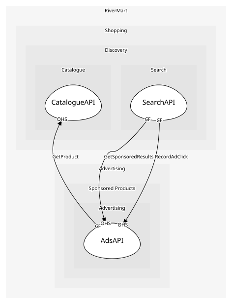

# AdsAPI
Campaign management for sellers and the sponsored-results read for Search

## Provides
| Name | Type | Internal | Pattern | Description | Schema | Raises |
| --- | --- | --- | --- | --- | --- | --- |
| CreateCampaign | operation | no | open-host-service | Start a campaign | - | CampaignLaunched |
| GetSponsoredResults | operation | no | open-host-service | Sponsored slots for a query, merged into organic results by Search | - | - |

## Consumes
> No consumptions.
	
