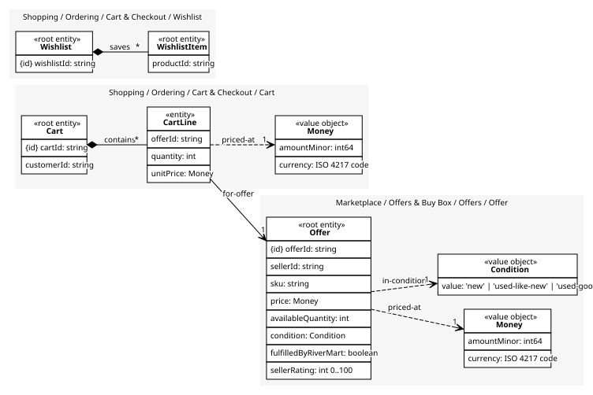

# Cart
What a customer intends to buy. Lines are part of it: a line outside a cart is nothing

## Entities and Value Objects
| Type | Name | Description | Attributes |
| --- | --- | --- | --- |
| Entity (Root) | **Cart** | One customer's open basket | **cartId**: `string`, customerId: `string` |
| Entity | CartLine | An offer and a quantity | offerId: `string`, quantity: `int`, unitPrice: `Money` |
| Value Object | Money | An amount in a currency: minor units and an ISO 4217 code | amountMinor: `int64`, currency: `ISO 4217 code` |

## Relationships
| Source | Description | Target | Relation | Cardinality |
| --- | --- | --- | --- | --- |
| [Cart](entities/cart/index.md) | contains | Cart - CartLine | includes | * |
| [CartLine](entities/cart_line/index.md) | priced-at | Cart - Money | uses | 1 |
| [CartLine](entities/cart_line/index.md) | for-offer | Offer - Offer | references | 1 |
| [Offer](../../../offers/aggregates/offer/entities/offer/index.md) | priced-at | Offer - Money | uses | 1 |
| [Offer](../../../offers/aggregates/offer/entities/offer/index.md) | in-condition | Offer - Condition | uses | 1 |
| [Wishlist](../wishlist/entities/wishlist/index.md) | saves | Wishlist - WishlistItem | includes | * |

## Invariants
| Name | Description | Constrains |
| --- | --- | --- |
| LineQuantityAtLeastOne | A line with quantity zero is removed, not kept | CartLine.quantity |
| MaxFiftyLines | A cart holds at most fifty lines; beyond that checkout times out | Cart |

## Provides
| Name | Type | Internal | Pattern | Description | Schema | Raises |
| --- | --- | --- | --- | --- | --- | --- |
| CartCheckedOut | event | no | published-language | The customer confirmed the basket; payment and order follow | [CartCheckedOut](../../index.md#schemas) | - |
| AddToCart | operation | no | open-host-service | Add or increase a line | - | - |
| Checkout | operation | no | open-host-service | Freeze the cart and start the purchase | [CartCheckedOut](../../index.md#schemas) | CartCheckedOut |

## Consumes
> No consumptions.
	
