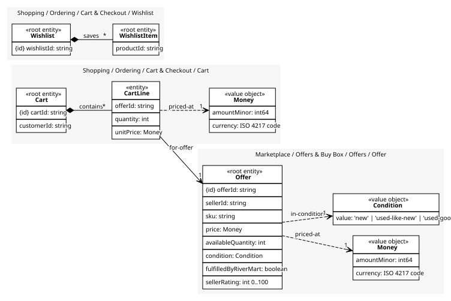

# Wishlist
Saved-for-later items

## Entities and Value Objects
| Type | Name | Description | Attributes |
| --- | --- | --- | --- |
| Entity (Root) | **Wishlist** | A named list of products a customer may buy later | **wishlistId**: `string` |
| Entity (Root) | **WishlistItem** | One saved product | productId: `string` |

## Relationships
| Source | Description | Target | Relation | Cardinality |
| --- | --- | --- | --- | --- |
| [Cart](../cart/entities/cart/index.md) | contains | Cart - CartLine | includes | * |
| [CartLine](../cart/entities/cart_line/index.md) | priced-at | Cart - Money | uses | 1 |
| [CartLine](../cart/entities/cart_line/index.md) | for-offer | Offer - Offer | references | 1 |
| [Offer](../../../offers/aggregates/offer/entities/offer/index.md) | priced-at | Offer - Money | uses | 1 |
| [Offer](../../../offers/aggregates/offer/entities/offer/index.md) | in-condition | Offer - Condition | uses | 1 |
| [Wishlist](entities/wishlist/index.md) | saves | Wishlist - WishlistItem | includes | * |

## Invariants
> No invariants.

## Provides
> No consumables.

## Consumes
> No consumptions.
	
