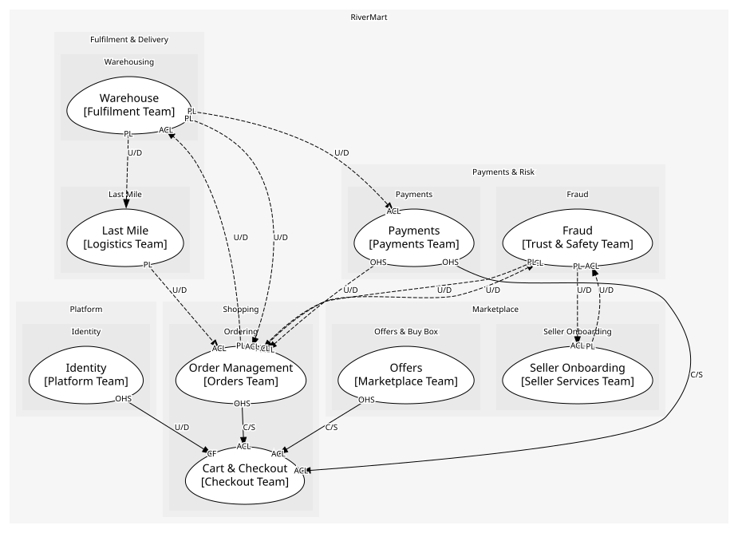
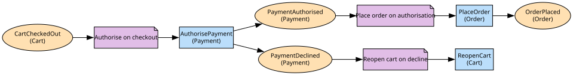

# Cart & Checkout
The cart and the checkout orchestration across payments and orders

**Owned by:** Checkout Team

## Serves
- [Shopping / Ordering](../../domains/shopping/subdomains/ordering/index.md) (supporting)

## Glossary
| Term | Definition | Aliases | Embodied by |
| --- | --- | --- | --- |
| **Cart** | The basket a customer fills before checkout | Basket | Cart |

## Aggregates

### [Cart](aggregates/cart/index.md)
What a customer intends to buy. Lines are part of it: a line outside a cart is nothing

### [Wishlist](aggregates/wishlist/index.md)
Saved-for-later items

	
## Services

### [CheckoutOrchestrator](services/checkout_orchestrator/index.md)
Drives a checkout through payment authorisation and order placement; an application service because it coordinates other contexts

## Schemas
| Name | Description | Attributes | Used by |
| --- | --- | --- | --- |
| CartCheckedOut | The snapshot handed to payments and orders | **cartId**: `string`, customerId: `string`, total: `Money` | CartCheckedOut, Checkout |

## Policies

| Name | Description | On | Then |
| --- | --- | --- | --- |
| Authorise on checkout | A checked-out cart is paid for before anything else happens | CartCheckedOut | AuthorisePayment |
| Place order on authorisation | Once funds are held the order becomes real | PaymentAuthorised | PlaceOrder |

## Context Relationships
| Upstream | Relationship | Downstream | Upstream Roles | Downstream Roles |
| --- | --- | --- | --- | --- |
| Offers | customer-supplier | Cart & Checkout | open-host-service | anti-corruption-layer |
| Payments | customer-supplier | Cart & Checkout | open-host-service | anti-corruption-layer |
| Order Management | customer-supplier | Cart & Checkout | open-host-service | anti-corruption-layer |
| Identity | upstream-downstream | Cart & Checkout | open-host-service | conformist |
| Warehouse | upstream-downstream (implied) | Payments | published-language | anti-corruption-layer |
| Order Management | upstream-downstream (implied) | Warehouse | published-language | anti-corruption-layer |
| Fraud | upstream-downstream (implied) | Order Management | published-language | anti-corruption-layer |
| Order Management | upstream-downstream (implied) | Fraud | published-language | anti-corruption-layer |
| Seller Onboarding | upstream-downstream (implied) | Fraud | published-language | anti-corruption-layer |
| Fraud | upstream-downstream (implied) | Seller Onboarding | published-language | anti-corruption-layer |
| Warehouse | upstream-downstream (implied) | Order Management | published-language | anti-corruption-layer |
| Payments | upstream-downstream (implied) | Order Management | open-host-service | anti-corruption-layer |
| Last Mile | upstream-downstream (implied) | Order Management | published-language | anti-corruption-layer |
| Warehouse | upstream-downstream (implied) | Last Mile | published-language | - |

## Consumptions
| Consumer | Consumed As | Provider | Consumable | Provided As |
| --- | --- | --- | --- | --- |
| [CheckoutOrchestrator](services/checkout_orchestrator/index.md) | anti-corruption-layer | OfferAPI | GetOffer | open-host-service |
| [CheckoutOrchestrator](services/checkout_orchestrator/index.md) | anti-corruption-layer | Payment | AuthorisePayment | open-host-service |
| [Payment](../payments/aggregates/payment/index.md) | anti-corruption-layer | FulfilmentOrder | ShipmentDispatched | published-language |
| [FulfilmentOrder](../warehouse/aggregates/fulfilment_order/index.md) | anti-corruption-layer | Order | ReturnRequested | published-language |
| [Order](../order_management/aggregates/order/index.md) | anti-corruption-layer | RiskAssessment | OrderRiskFlagged | published-language |
| [RiskAssessment](../fraud/aggregates/risk_assessment/index.md) | anti-corruption-layer | Order | OrderPlaced | published-language |
| [RiskAssessment](../fraud/aggregates/risk_assessment/index.md) | anti-corruption-layer | SellerAccount | SellerActivated | published-language |
| [SellerAccount](../seller_onboarding/aggregates/seller_account/index.md) | anti-corruption-layer | RiskAssessment | SellerRiskFlagged | published-language |
| [Order](../order_management/aggregates/order/index.md) | anti-corruption-layer | FulfilmentOrder | ShipmentDispatched | published-language |
| [Order](../order_management/aggregates/order/index.md) | anti-corruption-layer | FulfilmentOrder | ReturnReceived | published-language |
| [Order](../order_management/aggregates/order/index.md) | anti-corruption-layer | Payment | RefundPayment | open-host-service |
| [Order](../order_management/aggregates/order/index.md) | anti-corruption-layer | DeliveryRoute | ParcelDelivered | published-language |
| [DeliveryRoute](../last_mile/aggregates/delivery_route/index.md) | - | FulfilmentOrder | ShipmentDispatched | published-language |
| [CheckoutOrchestrator](services/checkout_orchestrator/index.md) | anti-corruption-layer | Order | PlaceOrder | open-host-service |
| [CheckoutOrchestrator](services/checkout_orchestrator/index.md) | conformist | IdentityAPI | GetCustomer | open-host-service |

