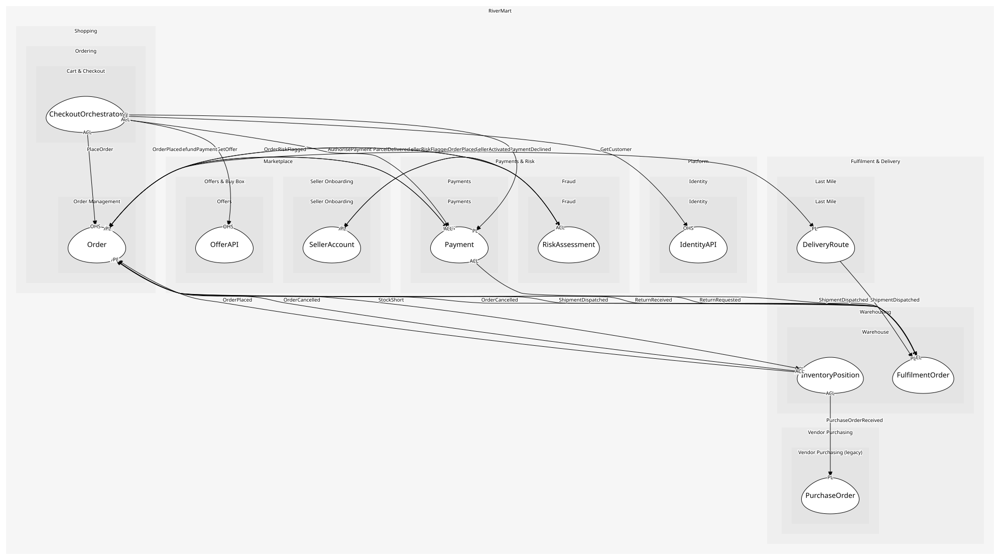

# CheckoutOrchestrator
Drives a checkout through payment authorisation and order placement; an application service because it coordinates other contexts

## Provides
> No consumables.

## Consumes

### GetOffer [anti-corruption-layer]
Read one offer with its current price and stock
- **Provider**: [OfferAPI](../../../offers/services/offer_api/index.md)

### AuthorisePayment [anti-corruption-layer]
Hold the cart total on the customer's instrument
- **Provider**: [Payment](../../../payments/aggregates/payment/index.md)

### PlaceOrder [anti-corruption-layer]
Create the order from a checked-out cart
- **Provider**: [Order](../../../order_management/aggregates/order/index.md)

### GetCustomer [conformist]
Read a customer's profile
- **Provider**: [IdentityAPI](../../../identity/services/identity_api/index.md)

	
