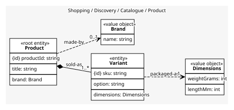
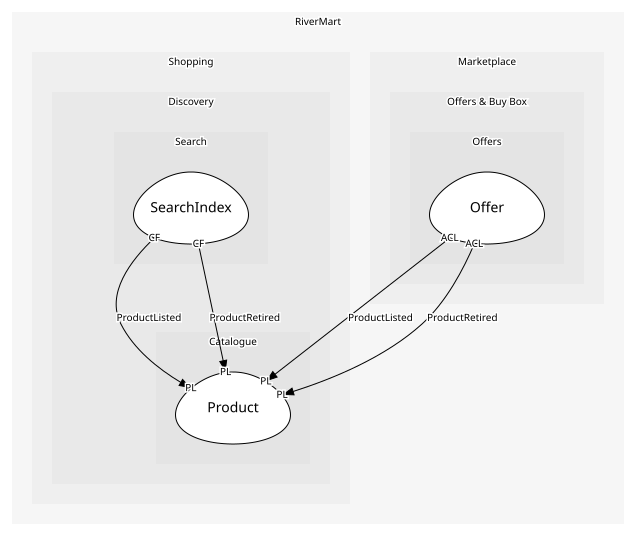

# Product
A product and its variants. One aggregate because a variant is meaningless without its parent

## Entities and Value Objects
| Type | Name | Description | Attributes |
| --- | --- | --- | --- |
| Entity (Root) | **Product** | The catalogue record for one thing that can be sold | **productId**: `string`, title: `string`, brand: `Brand` |
| Entity | Variant | A sellable version of the product (size, colour). An entity because each has its own SKU | **sku**: `string`, option: `string`, dimensions: `Dimensions` |
| Value Object | Brand | The maker's name; a value shared by every product of that brand | name: `string` |
| Value Object | Dimensions | Packaged size and weight, which the warehouse needs to slot it | weightGrams: `int`, lengthMm: `int` |

## Relationships
| Source | Description | Target | Relation | Cardinality |
| --- | --- | --- | --- | --- |
| [Product](entities/product/index.md) | sold-as | Product - Variant | includes | 1..* |
| [Variant](entities/variant/index.md) | packaged-as | Product - Dimensions | uses | 1 |
| [Product](entities/product/index.md) | made-by | Product - Brand | uses | 0..1 |

## Invariants
| Name | Description | Constrains |
| --- | --- | --- |
| AtLeastOneVariant | A product has at least one variant, or nothing can be offered | Product |
| UniqueSkuWithinProduct | Two variants of one product never share a SKU | Variant.sku |

## Provides
| Name | Type | Internal | Pattern | Description | Schema | Raises |
| --- | --- | --- | --- | --- | --- | --- |
| ProductListed | event | no | published-language | A product joined the catalogue | [ProductListed](../../index.md#schemas) | - |
| ProductRetired | event | no | published-language | A product was withdrawn; offers and index entries must go | [ProductRef](../../index.md#schemas) | - |

## Consumes
> No consumptions.
	
