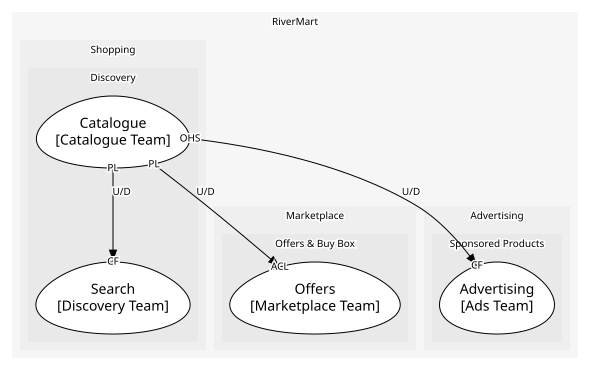

# Catalogue
The product records: what a thing is, independent of who sells it

**Owned by:** Catalogue Team

## Serves
- [Shopping / Discovery](../../domains/shopping/subdomains/discovery/index.md) (core)

## Glossary
| Term | Definition | Aliases | Embodied by |
| --- | --- | --- | --- |
| **Product** | One thing that can be sold, independent of who sells it | Item, Listing | Product |
| **SKU** | The identifier of one sellable variant | - | Variant |

## Aggregates

### [Product](aggregates/product/index.md)
A product and its variants. One aggregate because a variant is meaningless without its parent

	
## Services

### [CatalogueAPI](services/catalogue_api/index.md)
The documented product API used by sellers and internal contexts

## Schemas
| Name | Description | Attributes | Used by |
| --- | --- | --- | --- |
| ProductListed | What other contexts learn about a new product | **productId**: `string`, title: `string`, skus: `string[]` | ProductListed, ListProduct |
| ProductRef | - | **productId**: `string` | ProductRetired, RetireProduct, GetProduct |

## Policies
> No policies.

## Context Relationships
| Upstream | Relationship | Downstream | Upstream Roles | Downstream Roles |
| --- | --- | --- | --- | --- |
| Catalogue | upstream-downstream | Offers | published-language | anti-corruption-layer |
| Catalogue | upstream-downstream | Search | published-language | conformist |

## Consumptions
| Consumer | Consumed As | Provider | Consumable | Provided As |
| --- | --- | --- | --- | --- |
| [SearchIndex](../search/aggregates/search_index/index.md) | conformist | Product | ProductListed | published-language |
| [Offer](../offers/aggregates/offer/index.md) | anti-corruption-layer | Product | ProductListed | published-language |
| [SearchIndex](../search/aggregates/search_index/index.md) | conformist | Product | ProductRetired | published-language |
| [Offer](../offers/aggregates/offer/index.md) | anti-corruption-layer | Product | ProductRetired | published-language |

