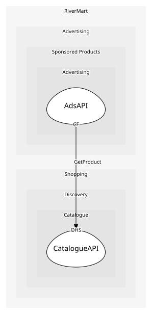

# CatalogueAPI
The documented product API used by sellers and internal contexts

## Provides
| Name | Type | Internal | Pattern | Description | Schema | Raises |
| --- | --- | --- | --- | --- | --- | --- |
| ListProduct | operation | no | open-host-service | Create a product with its first variant | [ProductListed](../../index.md#schemas) | ProductListed |
| RetireProduct | operation | no | open-host-service | Withdraw a product | [ProductRef](../../index.md#schemas) | ProductRetired |
| GetProduct | operation | no | open-host-service | Read one product with its variants | [ProductRef](../../index.md#schemas) | - |

## Consumes
> No consumptions.
	
