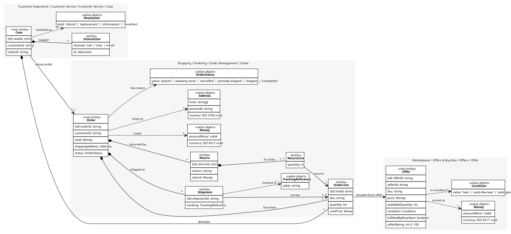
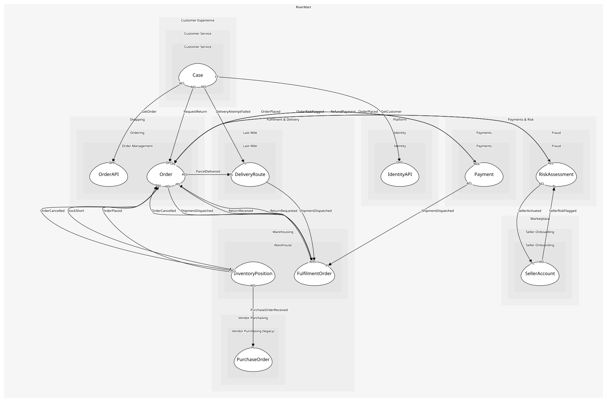

# Case
A customer's problem and everything done about it

## Entities and Value Objects
| Type | Name | Description | Attributes |
| --- | --- | --- | --- |
| Entity (Root) | **Case** | One problem, one owner, one outcome | **caseId**: `string`, customerId: `string`, orderId: `string` |
| Entity | Interaction | A call, chat or email on the case | channel: `'call' | 'chat' | 'email'`, at: `date-time` |
| Value Object | Resolution | How it ended: refund, replacement, information, no action | kind: `'refund' | 'replacement' | 'information' | 'no-action'` |

## Relationships
| Source | Description | Target | Relation | Cardinality |
| --- | --- | --- | --- | --- |
| [Case](entities/case/index.md) | logged | Case - Interaction | includes | * |
| [Case](entities/case/index.md) | resolved-as | Case - Resolution | uses | 0..1 |
| [Case](entities/case/index.md) | about-order | Order - Order | references | 0..1 |
| [Order](../../../order_management/aggregates/order/entities/order/index.md) | has-lines | Order - OrderLine | includes | 1..* |
| [OrderLine](../../../order_management/aggregates/order/entities/order_line/index.md) | bought-from-offer | Offer - Offer | references | 1 |
| [Offer](../../../offers/aggregates/offer/entities/offer/index.md) | priced-at | Offer - Money | uses | 1 |
| [Offer](../../../offers/aggregates/offer/entities/offer/index.md) | in-condition | Offer - Condition | uses | 1 |
| [Order](../../../order_management/aggregates/order/entities/order/index.md) | shipped-in | Order - Shipment | includes | * |
| [Shipment](../../../order_management/aggregates/order/entities/shipment/index.md) | carries | Order - OrderLine | references | 1..* |
| [Shipment](../../../order_management/aggregates/order/entities/shipment/index.md) | tracked-as | Order - TrackingReference | uses | 0..1 |
| [Order](../../../order_management/aggregates/order/entities/order/index.md) | returned-by | Order - Return | includes | * |
| [Return](../../../order_management/aggregates/order/entities/return/index.md) | for-lines | Order - ReturnLine | includes | 1..* |
| [ReturnLine](../../../order_management/aggregates/order/entities/return_line/index.md) | returns | Order - OrderLine | references | 1 |
| [Order](../../../order_management/aggregates/order/entities/order/index.md) | totals | Order - Money | uses | 1 |
| [Order](../../../order_management/aggregates/order/entities/order/index.md) | ships-to | Order - Address | uses | 1 |
| [Order](../../../order_management/aggregates/order/entities/order/index.md) | has-status | Order - OrderStatus | uses | 1 |
| [Case](entities/case/index.md) | disputes | Order - OrderLine | includes | * |

## Invariants
| Name | Description | Constrains |
| --- | --- | --- |
| ResolvedCaseHasInteraction | A case is never resolved without at least one interaction with the customer | Case |

## Provides
| Name | Type | Internal | Pattern | Description | Schema | Raises |
| --- | --- | --- | --- | --- | --- | --- |
| CaseOpened | event | no | published-language | A case exists and needs an agent | - | - |
| OpenCase | operation | no | open-host-service | Create a case for a customer, optionally about an order | - | CaseOpened |
| ResolveCase | operation | yes | - | Close the case with a resolution | - | - |

## Consumes

### GetOrder [anti-corruption-layer]
Read one order with lines, shipments and returns
- **Provider**: [OrderAPI](../../../order_management/services/order_api/index.md)

### RequestReturn [anti-corruption-layer]
Open a return for some lines
- **Provider**: [Order](../../../order_management/aggregates/order/index.md)

### DeliveryAttemptFailed [anti-corruption-layer]
Nobody home, or the address was wrong
- **Provider**: [DeliveryRoute](../../../last_mile/aggregates/delivery_route/index.md)

### GetCustomer [conformist]
Read a customer's profile
- **Provider**: [IdentityAPI](../../../identity/services/identity_api/index.md)

	
