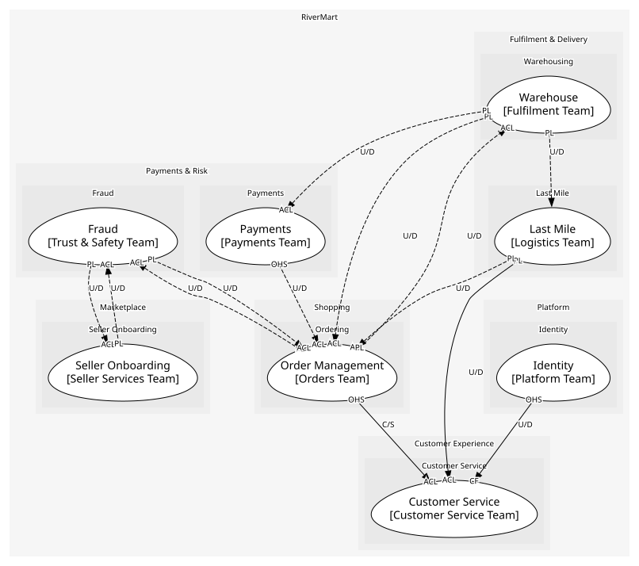
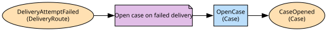

# Customer Service
Cases raised by or for customers, and their resolution

**Owned by:** Customer Service Team

## Serves
- [Customer Experience / Customer Service](../../domains/customer_experience/subdomains/customer_service/index.md) (supporting)

## Glossary
| Term | Definition | Aliases | Embodied by |
| --- | --- | --- | --- |
| **Case** | One customer problem tracked to an outcome | Ticket, Contact | Case |

## Aggregates

### [Case](aggregates/case/index.md)
A customer's problem and everything done about it

	
## Services
> No services.

## Schemas
> No schemas.

## Policies

| Name | Description | On | Then |
| --- | --- | --- | --- |
| Open case on failed delivery | A failed attempt reaches an agent before the customer has to call | DeliveryAttemptFailed | OpenCase |

## Context Relationships
| Upstream | Relationship | Downstream | Upstream Roles | Downstream Roles |
| --- | --- | --- | --- | --- |
| Last Mile | upstream-downstream | Customer Service | published-language | anti-corruption-layer |
| Order Management | customer-supplier | Customer Service | open-host-service | anti-corruption-layer |
| Identity | upstream-downstream | Customer Service | open-host-service | conformist |
| Fraud | upstream-downstream (implied) | Order Management | published-language | anti-corruption-layer |
| Order Management | upstream-downstream (implied) | Fraud | published-language | anti-corruption-layer |
| Seller Onboarding | upstream-downstream (implied) | Fraud | published-language | anti-corruption-layer |
| Fraud | upstream-downstream (implied) | Seller Onboarding | published-language | anti-corruption-layer |
| Warehouse | upstream-downstream (implied) | Order Management | published-language | anti-corruption-layer |
| Order Management | upstream-downstream (implied) | Warehouse | published-language | anti-corruption-layer |
| Vendor Purchasing (legacy) | upstream-downstream (implied) | Warehouse | published-language | anti-corruption-layer |
| Payments | upstream-downstream (implied) | Order Management | open-host-service | anti-corruption-layer |
| Order Management | upstream-downstream (implied) | Payments | published-language | anti-corruption-layer |
| Warehouse | upstream-downstream (implied) | Payments | published-language | anti-corruption-layer |
| Last Mile | upstream-downstream (implied) | Order Management | published-language | anti-corruption-layer |
| Warehouse | upstream-downstream (implied) | Last Mile | published-language | - |

## Consumptions
| Consumer | Consumed As | Provider | Consumable | Provided As |
| --- | --- | --- | --- | --- |
| [Case](aggregates/case/index.md) | anti-corruption-layer | OrderAPI | GetOrder | open-host-service |
| [Case](aggregates/case/index.md) | anti-corruption-layer | Order | RequestReturn | open-host-service |
| [Order](../order_management/aggregates/order/index.md) | anti-corruption-layer | RiskAssessment | OrderRiskFlagged | published-language |
| [RiskAssessment](../fraud/aggregates/risk_assessment/index.md) | anti-corruption-layer | Order | OrderPlaced | published-language |
| [RiskAssessment](../fraud/aggregates/risk_assessment/index.md) | anti-corruption-layer | SellerAccount | SellerActivated | published-language |
| [SellerAccount](../seller_onboarding/aggregates/seller_account/index.md) | anti-corruption-layer | RiskAssessment | SellerRiskFlagged | published-language |
| [Order](../order_management/aggregates/order/index.md) | anti-corruption-layer | FulfilmentOrder | ShipmentDispatched | published-language |
| [FulfilmentOrder](../warehouse/aggregates/fulfilment_order/index.md) | anti-corruption-layer | Order | ReturnRequested | published-language |
| [FulfilmentOrder](../warehouse/aggregates/fulfilment_order/index.md) | anti-corruption-layer | Order | OrderCancelled | published-language |
| [Order](../order_management/aggregates/order/index.md) | anti-corruption-layer | FulfilmentOrder | ReturnReceived | published-language |
| [Order](../order_management/aggregates/order/index.md) | anti-corruption-layer | InventoryPosition | StockShort | published-language |
| [InventoryPosition](../warehouse/aggregates/inventory_position/index.md) | anti-corruption-layer | Order | OrderPlaced | published-language |
| [InventoryPosition](../warehouse/aggregates/inventory_position/index.md) | anti-corruption-layer | Order | OrderCancelled | published-language |
| [InventoryPosition](../warehouse/aggregates/inventory_position/index.md) | anti-corruption-layer | PurchaseOrder | PurchaseOrderReceived | published-language |
| [Order](../order_management/aggregates/order/index.md) | anti-corruption-layer | Payment | RefundPayment | open-host-service |
| [Payment](../payments/aggregates/payment/index.md) | anti-corruption-layer | Order | OrderPlaced | published-language |
| [Payment](../payments/aggregates/payment/index.md) | anti-corruption-layer | FulfilmentOrder | ShipmentDispatched | published-language |
| [Order](../order_management/aggregates/order/index.md) | anti-corruption-layer | DeliveryRoute | ParcelDelivered | published-language |
| [DeliveryRoute](../last_mile/aggregates/delivery_route/index.md) | - | FulfilmentOrder | ShipmentDispatched | published-language |
| [Case](aggregates/case/index.md) | anti-corruption-layer | DeliveryRoute | DeliveryAttemptFailed | published-language |
| [Case](aggregates/case/index.md) | conformist | IdentityAPI | GetCustomer | open-host-service |

