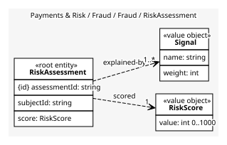
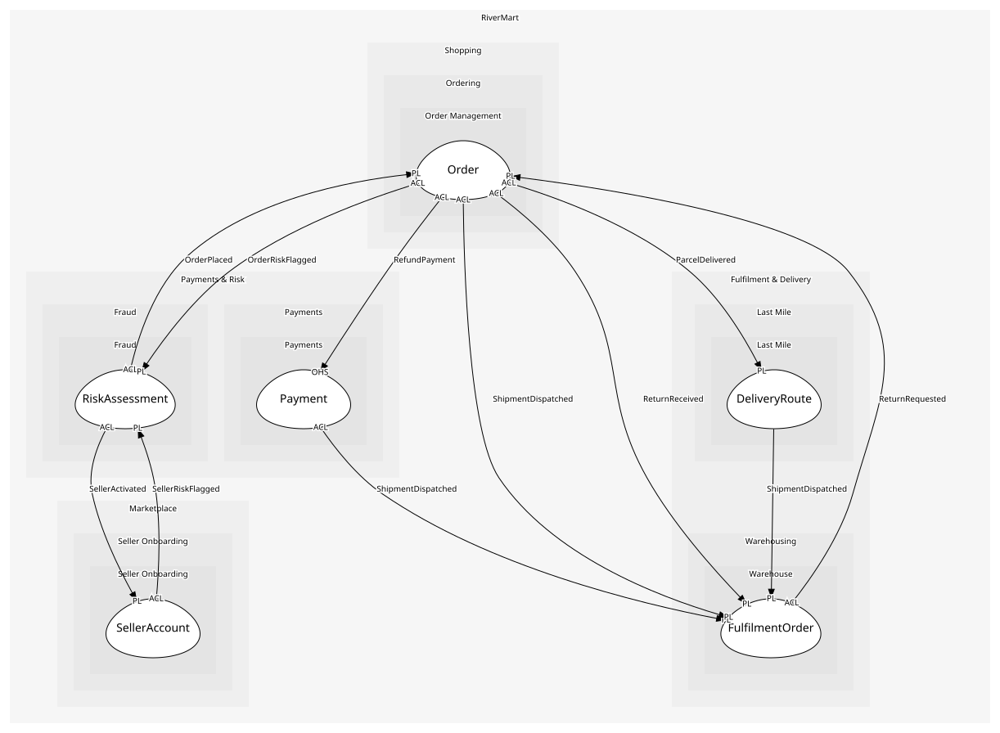

# RiskAssessment
The score and signals for one order or seller, kept so decisions can be explained

## Entities and Value Objects
| Type | Name | Description | Attributes |
| --- | --- | --- | --- |
| Entity (Root) | **RiskAssessment** | One scoring run | **assessmentId**: `string`, subjectId: `string`, score: `RiskScore` |
| Value Object | RiskScore | 0 to 1000; above the threshold is flagged | value: `int 0..1000` |
| Value Object | Signal | A named contribution to the score, e.g. 'new account, high value' | name: `string`, weight: `int` |

## Relationships
| Source | Description | Target | Relation | Cardinality |
| --- | --- | --- | --- | --- |
| [RiskAssessment](entities/risk_assessment/index.md) | scored | RiskAssessment - RiskScore | uses | 1 |
| [RiskAssessment](entities/risk_assessment/index.md) | explained-by | RiskAssessment - Signal | uses | 1..* |

## Invariants
| Name | Description | Constrains |
| --- | --- | --- |
| ScoreExplained | A flagged score always carries at least one signal, so an agent can defend it | Signal |

## Provides
| Name | Type | Internal | Pattern | Description | Schema | Raises |
| --- | --- | --- | --- | --- | --- | --- |
| OrderRiskFlagged | event | no | published-language | An order scored above the threshold | [OrderRiskFlagged](../../index.md#schemas) | - |
| SellerRiskFlagged | event | no | published-language | A seller looks like a bad actor | [SellerRiskFlagged](../../index.md#schemas) | - |

## Consumes

### OrderPlaced [anti-corruption-layer]
A paid-for order exists
- **Provider**: [Order](../../../order_management/aggregates/order/index.md)

### SellerActivated [anti-corruption-layer]
A seller may now publish offers
- **Provider**: [SellerAccount](../../../seller_onboarding/aggregates/seller_account/index.md)

	
