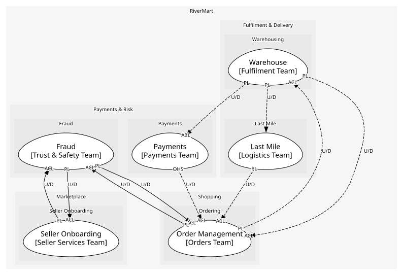
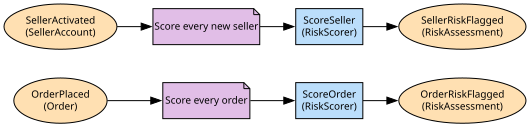

# Fraud
Risk scoring for orders and sellers

**Owned by:** Trust & Safety Team

## Serves
- [Payments & Risk / Fraud](../../domains/payments_&_risk/subdomains/fraud/index.md) (supporting)

## Glossary
| Term | Definition | Aliases | Embodied by |
| --- | --- | --- | --- |
| **Flag** | A score above threshold; it pauses the subject until reviewed | - | RiskScore |

## Aggregates

### [RiskAssessment](aggregates/risk_assessment/index.md)
The score and signals for one order or seller, kept so decisions can be explained

	
## Services

### [RiskScorer](services/risk_scorer/index.md)
Runs the model over an order or seller and its history; a domain service because it reads across assessments

## Schemas
| Name | Description | Attributes | Used by |
| --- | --- | --- | --- |
| OrderRiskFlagged | - | **orderId**: `string`, score: `RiskScore` | OrderRiskFlagged |
| SellerRiskFlagged | - | **sellerId**: `string`, score: `RiskScore` | SellerRiskFlagged |

## Policies

| Name | Description | On | Then |
| --- | --- | --- | --- |
| Score every order | No order ships unscored | OrderPlaced | ScoreOrder |
| Score every new seller | Activation triggers a first assessment | SellerActivated | ScoreSeller |

## Context Relationships
| Upstream | Relationship | Downstream | Upstream Roles | Downstream Roles |
| --- | --- | --- | --- | --- |
| Order Management | upstream-downstream | Fraud | published-language | anti-corruption-layer |
| Fraud | upstream-downstream | Order Management | published-language | anti-corruption-layer |
| Seller Onboarding | upstream-downstream | Fraud | published-language | anti-corruption-layer |
| Fraud | upstream-downstream | Seller Onboarding | published-language | anti-corruption-layer |
| Warehouse | upstream-downstream (implied) | Order Management | published-language | anti-corruption-layer |
| Order Management | upstream-downstream (implied) | Warehouse | published-language | anti-corruption-layer |
| Payments | upstream-downstream (implied) | Order Management | open-host-service | anti-corruption-layer |
| Warehouse | upstream-downstream (implied) | Payments | published-language | anti-corruption-layer |
| Last Mile | upstream-downstream (implied) | Order Management | published-language | anti-corruption-layer |
| Warehouse | upstream-downstream (implied) | Last Mile | published-language | - |

## Consumptions
| Consumer | Consumed As | Provider | Consumable | Provided As |
| --- | --- | --- | --- | --- |
| [Order](../order_management/aggregates/order/index.md) | anti-corruption-layer | RiskAssessment | OrderRiskFlagged | published-language |
| [SellerAccount](../seller_onboarding/aggregates/seller_account/index.md) | anti-corruption-layer | RiskAssessment | SellerRiskFlagged | published-language |
| [RiskAssessment](aggregates/risk_assessment/index.md) | anti-corruption-layer | Order | OrderPlaced | published-language |
| [Order](../order_management/aggregates/order/index.md) | anti-corruption-layer | FulfilmentOrder | ShipmentDispatched | published-language |
| [FulfilmentOrder](../warehouse/aggregates/fulfilment_order/index.md) | anti-corruption-layer | Order | ReturnRequested | published-language |
| [Order](../order_management/aggregates/order/index.md) | anti-corruption-layer | FulfilmentOrder | ReturnReceived | published-language |
| [Order](../order_management/aggregates/order/index.md) | anti-corruption-layer | Payment | RefundPayment | open-host-service |
| [Payment](../payments/aggregates/payment/index.md) | anti-corruption-layer | FulfilmentOrder | ShipmentDispatched | published-language |
| [Order](../order_management/aggregates/order/index.md) | anti-corruption-layer | DeliveryRoute | ParcelDelivered | published-language |
| [DeliveryRoute](../last_mile/aggregates/delivery_route/index.md) | - | FulfilmentOrder | ShipmentDispatched | published-language |
| [RiskAssessment](aggregates/risk_assessment/index.md) | anti-corruption-layer | SellerAccount | SellerActivated | published-language |

