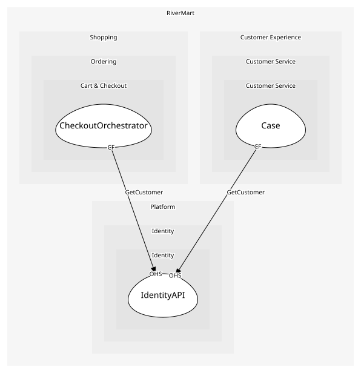

# IdentityAPI
Account endpoints

## Provides
| Name | Type | Internal | Pattern | Description | Schema | Raises |
| --- | --- | --- | --- | --- | --- | --- |
| RegisterCustomer | operation | no | open-host-service | Create an account | - | CustomerRegistered |
| GetCustomer | operation | no | open-host-service | Read a customer's profile | - | - |

## Consumes
> No consumptions.
	
