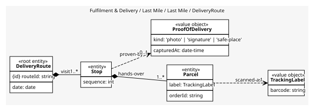
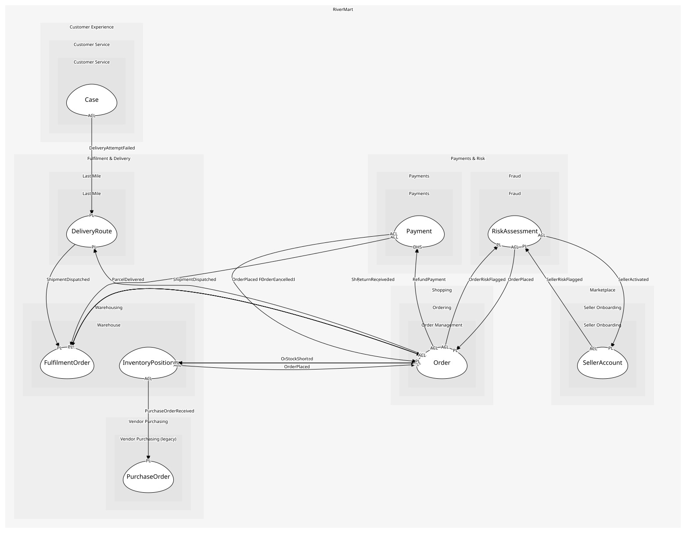

# DeliveryRoute
A driver's day: an ordered list of stops

## Entities and Value Objects
| Type | Name | Description | Attributes |
| --- | --- | --- | --- |
| Entity (Root) | **DeliveryRoute** | One vehicle, one date, one sequence of stops | **routeId**: `string`, date: `date` |
| Entity | Parcel | One labelled item to hand over at a stop; the warehouse's package once it is on a van | label: `TrackingLabel`, orderId: `string` |
| Entity | Stop | One address and the parcels to hand over there | sequence: `int` |
| Value Object | TrackingLabel | The same barcode and scan vocabulary the warehouse prints; the shared kernel means both contexts read one format | barcode: `string` |
| Value Object | ProofOfDelivery | Photo, signature or safe-place note | kind: `'photo' | 'signature' | 'safe-place'`, capturedAt: `date-time` |

## Relationships
| Source | Description | Target | Relation | Cardinality |
| --- | --- | --- | --- | --- |
| [DeliveryRoute](entities/delivery_route/index.md) | visits | DeliveryRoute - Stop | includes | 1..* |
| [Stop](entities/stop/index.md) | hands-over | DeliveryRoute - Parcel | includes | 1..* |
| [Parcel](entities/parcel/index.md) | scanned-as | DeliveryRoute - TrackingLabel | uses | 1 |
| [Stop](entities/stop/index.md) | proven-by | DeliveryRoute - ProofOfDelivery | uses | 0..1 |

## Invariants
| Name | Description | Constrains |
| --- | --- | --- |
| MaxStopsPerRoute | A route has at most 150 stops, the most a driver can do in a shift | DeliveryRoute |

## Provides
| Name | Type | Internal | Pattern | Description | Schema | Raises |
| --- | --- | --- | --- | --- | --- | --- |
| ParcelDelivered | event | no | published-language | Handed over with proof | [ParcelDelivered](../../index.md#schemas) | - |
| DeliveryAttemptFailed | event | no | published-language | Nobody home, or the address was wrong | [DeliveryAttemptFailed](../../index.md#schemas) | - |
| AssignParcelToRoute | operation | yes | - | Put a dispatched package on tomorrow's route | - | - |
| RecordDelivery | operation | yes | - | The driver scans the label at the door | - | ParcelDelivered, DeliveryAttemptFailed |

## Consumes

### ShipmentDispatched 
A package left the dock
- **Provider**: [FulfilmentOrder](../../../warehouse/aggregates/fulfilment_order/index.md)

	
