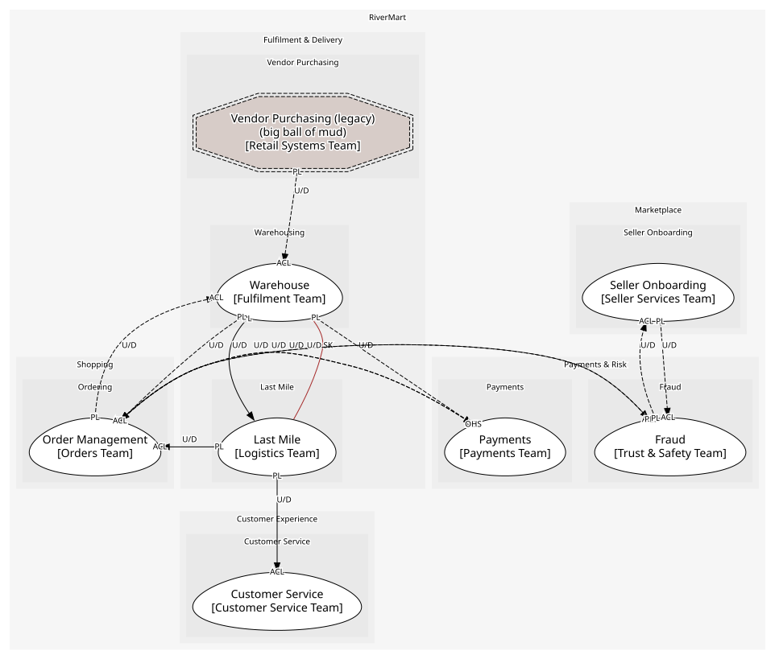
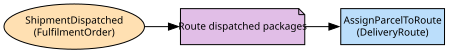

# Last Mile
Delivery routes, stops and proof of delivery

**Owned by:** Logistics Team

## Serves
- [Fulfilment & Delivery / Last Mile](../../domains/fulfilment_&_delivery/subdomains/last_mile/index.md) (supporting)

## Glossary
| Term | Definition | Aliases | Embodied by |
| --- | --- | --- | --- |
| **Stop** | One address on a route, however many parcels go there | - | Stop |
| **Parcel** | The labelled item handed over at a stop. Orders calls it a shipment and the warehouse a package; the label is the one thing all three agree on | Package | Parcel |

## Aggregates

### [DeliveryRoute](aggregates/delivery_route/index.md)
A driver's day: an ordered list of stops

	
## Services
> No services.

## Schemas
| Name | Description | Attributes | Used by |
| --- | --- | --- | --- |
| ParcelDelivered | - | **barcode**: `string`, orderId: `string`, deliveredAt: `date-time` | ParcelDelivered |
| DeliveryAttemptFailed | - | **barcode**: `string`, orderId: `string`, reason: `string` | DeliveryAttemptFailed |

## Policies

| Name | Description | On | Then |
| --- | --- | --- | --- |
| Route dispatched packages | Every dispatched package gets a stop | ShipmentDispatched | AssignParcelToRoute |

## Context Relationships
| Upstream | Relationship | Downstream | Upstream Roles | Downstream Roles |
| --- | --- | --- | --- | --- |
| Warehouse | upstream-downstream | Last Mile | published-language | - |
| Last Mile | upstream-downstream | Order Management | published-language | anti-corruption-layer |
| Last Mile | upstream-downstream | Customer Service | published-language | anti-corruption-layer |
| Warehouse | shared-kernel | Last Mile | - | - |
| Order Management | upstream-downstream (implied) | Warehouse | published-language | anti-corruption-layer |
| Fraud | upstream-downstream (implied) | Order Management | published-language | anti-corruption-layer |
| Order Management | upstream-downstream (implied) | Fraud | published-language | anti-corruption-layer |
| Seller Onboarding | upstream-downstream (implied) | Fraud | published-language | anti-corruption-layer |
| Fraud | upstream-downstream (implied) | Seller Onboarding | published-language | anti-corruption-layer |
| Warehouse | upstream-downstream (implied) | Order Management | published-language | anti-corruption-layer |
| Vendor Purchasing (legacy) | upstream-downstream (implied) | Warehouse | published-language | anti-corruption-layer |
| Payments | upstream-downstream (implied) | Order Management | open-host-service | anti-corruption-layer |
| Order Management | upstream-downstream (implied) | Payments | published-language | anti-corruption-layer |
| Warehouse | upstream-downstream (implied) | Payments | published-language | anti-corruption-layer |

## Consumptions
| Consumer | Consumed As | Provider | Consumable | Provided As |
| --- | --- | --- | --- | --- |
| [Order](../order_management/aggregates/order/index.md) | anti-corruption-layer | DeliveryRoute | ParcelDelivered | published-language |
| [Case](../customer_service/aggregates/case/index.md) | anti-corruption-layer | DeliveryRoute | DeliveryAttemptFailed | published-language |
| [DeliveryRoute](aggregates/delivery_route/index.md) | - | FulfilmentOrder | ShipmentDispatched | published-language |
| [FulfilmentOrder](../warehouse/aggregates/fulfilment_order/index.md) | anti-corruption-layer | Order | ReturnRequested | published-language |
| [Order](../order_management/aggregates/order/index.md) | anti-corruption-layer | RiskAssessment | OrderRiskFlagged | published-language |
| [RiskAssessment](../fraud/aggregates/risk_assessment/index.md) | anti-corruption-layer | Order | OrderPlaced | published-language |
| [RiskAssessment](../fraud/aggregates/risk_assessment/index.md) | anti-corruption-layer | SellerAccount | SellerActivated | published-language |
| [SellerAccount](../seller_onboarding/aggregates/seller_account/index.md) | anti-corruption-layer | RiskAssessment | SellerRiskFlagged | published-language |
| [Order](../order_management/aggregates/order/index.md) | anti-corruption-layer | FulfilmentOrder | ShipmentDispatched | published-language |
| [Order](../order_management/aggregates/order/index.md) | anti-corruption-layer | FulfilmentOrder | ReturnReceived | published-language |
| [Order](../order_management/aggregates/order/index.md) | anti-corruption-layer | InventoryPosition | StockShort | published-language |
| [InventoryPosition](../warehouse/aggregates/inventory_position/index.md) | anti-corruption-layer | Order | OrderPlaced | published-language |
| [InventoryPosition](../warehouse/aggregates/inventory_position/index.md) | anti-corruption-layer | Order | OrderCancelled | published-language |
| [InventoryPosition](../warehouse/aggregates/inventory_position/index.md) | anti-corruption-layer | PurchaseOrder | PurchaseOrderReceived | published-language |
| [Order](../order_management/aggregates/order/index.md) | anti-corruption-layer | Payment | RefundPayment | open-host-service |
| [Payment](../payments/aggregates/payment/index.md) | anti-corruption-layer | Order | OrderPlaced | published-language |
| [Payment](../payments/aggregates/payment/index.md) | anti-corruption-layer | FulfilmentOrder | ShipmentDispatched | published-language |
| [FulfilmentOrder](../warehouse/aggregates/fulfilment_order/index.md) | anti-corruption-layer | Order | OrderCancelled | published-language |

