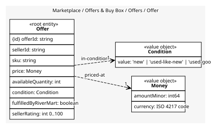
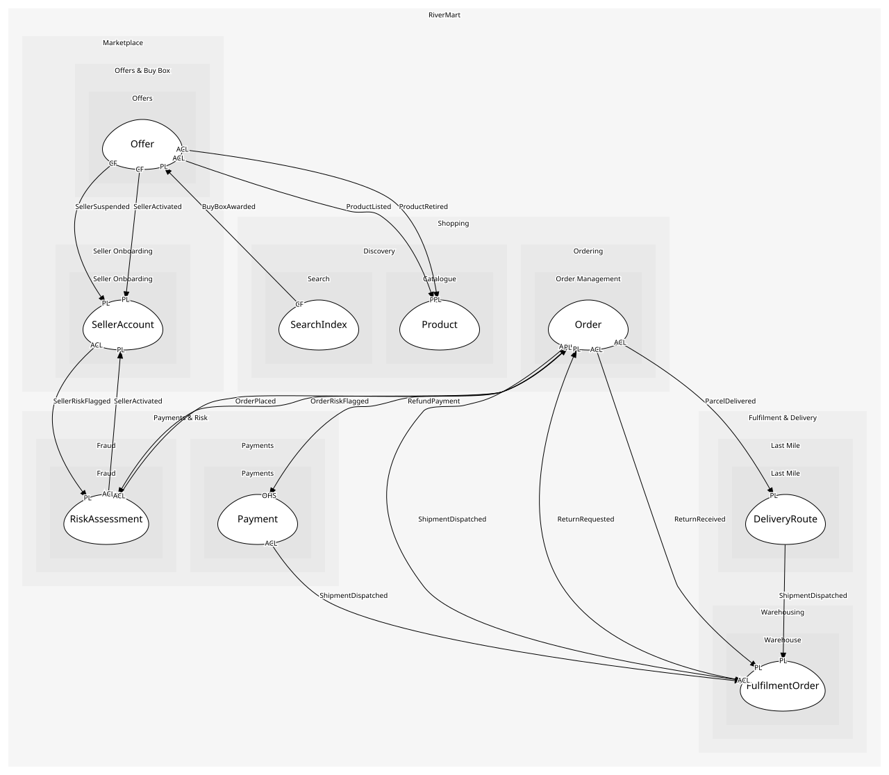

# Offer
One seller's price and stock for one SKU

## Entities and Value Objects
| Type | Name | Description | Attributes |
| --- | --- | --- | --- |
| Entity (Root) | **Offer** | The seller's terms for a SKU | **offerId**: `string`, sellerId: `string`, sku: `string`, price: `Money`, availableQuantity: `int`, condition: `Condition` |
| Value Object | Money | An amount in a currency: minor units and an ISO 4217 code | amountMinor: `int64`, currency: `ISO 4217 code` |
| Value Object | Condition | new, used-like-new, used-good; buyers filter on it | value: `'new' | 'used-like-new' | 'used-good'` |

## Relationships
| Source | Description | Target | Relation | Cardinality |
| --- | --- | --- | --- | --- |
| [Offer](entities/offer/index.md) | priced-at | Offer - Money | uses | 1 |
| [Offer](entities/offer/index.md) | in-condition | Offer - Condition | uses | 1 |

## Invariants
| Name | Description | Constrains |
| --- | --- | --- |
| PricePositive | An offer's price is greater than zero | Offer.price |
| OneActiveOfferPerSellerSku | A seller has at most one active offer per SKU, so the buy box compares like with like | Offer |

## Provides
| Name | Type | Internal | Pattern | Description | Schema | Raises |
| --- | --- | --- | --- | --- | --- | --- |
| OfferPublished | event | no | published-language | A seller's offer went live | [OfferPublished](../../index.md#schemas) | - |
| OfferWithdrawn | event | no | published-language | An offer was taken down | [OfferRef](../../index.md#schemas) | - |
| BuyBoxAwarded | event | no | published-language | The offer shown by default for a SKU changed | [BuyBoxAwarded](../../index.md#schemas) | - |
| WithdrawSellerOffers | operation | yes | - | Take down every offer of a seller | - | OfferWithdrawn |

## Consumes

### ProductListed [anti-corruption-layer]
A product joined the catalogue
- **Provider**: [Product](../../../catalogue/aggregates/product/index.md)

### ProductRetired [anti-corruption-layer]
A product was withdrawn; offers and index entries must go
- **Provider**: [Product](../../../catalogue/aggregates/product/index.md)

### SellerActivated [conformist]
A seller may now publish offers
- **Provider**: [SellerAccount](../../../seller_onboarding/aggregates/seller_account/index.md)

### SellerSuspended [conformist]
A seller lost the right to sell; offers and campaigns must stop
- **Provider**: [SellerAccount](../../../seller_onboarding/aggregates/seller_account/index.md)

	
