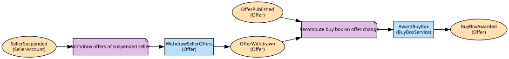

# Offers
Sellers' offers on catalogue products and the buy box award

**Owned by:** Marketplace Team

## Serves
- [Marketplace / Offers & Buy Box](../../domains/marketplace/subdomains/offers_&_buy_box/index.md) (core)

## Glossary
| Term | Definition | Aliases | Embodied by |
| --- | --- | --- | --- |
| **Buy Box** | The default offer a customer adds to cart for a SKU | Featured Offer | BuyBoxService |
| **Offer** | A seller's price, stock and condition for one SKU; first-party retail is a seller like any other for this purpose | - | Offer |

## Aggregates

### [Offer](aggregates/offer/index.md)
One seller's price and stock for one SKU. RiverMart's own retail arm is one more seller here and wins the buy box on the same rules

	
## Services

### [BuyBoxService](services/buy_box_service/index.md)
Compares all offers on a SKU by landed price, delivery speed and seller rating; a domain service because it reads across offers

### [OfferAPI](services/offer_api/index.md)
Seller-facing and internal offer endpoints

## Schemas
| Name | Description | Attributes | Used by |
| --- | --- | --- | --- |
| OfferPublished | - | **offerId**: `string`, sku: `string`, price: `Money` | OfferPublished, PublishOffer |
| BuyBoxAwarded | - | **sku**: `string`, offerId: `string` | BuyBoxAwarded |
| OfferRef | - | **offerId**: `string` | OfferWithdrawn, GetOffer |

## Policies

| Name | Description | On | Then |
| --- | --- | --- | --- |
| Recompute buy box on offer change | Any published offer can win or lose the buy box | OfferPublished, OfferWithdrawn | AwardBuyBox |
| Withdraw offers of suspended seller | A suspended seller's offers come down immediately | SellerSuspended | WithdrawSellerOffers |

## Context Relationships
| Upstream | Relationship | Downstream | Upstream Roles | Downstream Roles |
| --- | --- | --- | --- | --- |
| Catalogue | upstream-downstream | Offers | published-language | anti-corruption-layer |
| Offers | upstream-downstream | Search | published-language | conformist |
| Seller Onboarding | upstream-downstream | Offers | published-language | conformist |
| Offers | customer-supplier | Cart & Checkout | open-host-service | anti-corruption-layer |
| Offers | upstream-downstream | Order Management | open-host-service | conformist |
| Fraud | upstream-downstream (implied) | Seller Onboarding | published-language | anti-corruption-layer |
| Order Management | upstream-downstream (implied) | Fraud | published-language | anti-corruption-layer |
| Fraud | upstream-downstream (implied) | Order Management | published-language | anti-corruption-layer |
| Warehouse | upstream-downstream (implied) | Order Management | published-language | anti-corruption-layer |
| Order Management | upstream-downstream (implied) | Warehouse | published-language | anti-corruption-layer |
| Vendor Purchasing (legacy) | upstream-downstream (implied) | Warehouse | published-language | anti-corruption-layer |
| Payments | upstream-downstream (implied) | Order Management | open-host-service | anti-corruption-layer |
| Order Management | upstream-downstream (implied) | Payments | published-language | anti-corruption-layer |
| Warehouse | upstream-downstream (implied) | Payments | published-language | anti-corruption-layer |
| Last Mile | upstream-downstream (implied) | Order Management | published-language | anti-corruption-layer |
| Warehouse | upstream-downstream (implied) | Last Mile | published-language | - |
| Seller Onboarding | upstream-downstream (implied) | Fraud | published-language | anti-corruption-layer |

## Consumptions
| Consumer | Consumed As | Provider | Consumable | Provided As |
| --- | --- | --- | --- | --- |
| [CheckoutOrchestrator](../cart_&_checkout/services/checkout_orchestrator/index.md) | anti-corruption-layer | OfferAPI | GetOffer | open-host-service |
| [SearchIndex](../search/aggregates/search_index/index.md) | conformist | Offer | BuyBoxAwarded | published-language |
| [Offer](aggregates/offer/index.md) | anti-corruption-layer | Product | ProductListed | published-language |
| [Offer](aggregates/offer/index.md) | anti-corruption-layer | Product | ProductRetired | published-language |
| [Offer](aggregates/offer/index.md) | conformist | SellerAccount | SellerActivated | published-language |
| [SellerAccount](../seller_onboarding/aggregates/seller_account/index.md) | anti-corruption-layer | RiskAssessment | SellerRiskFlagged | published-language |
| [RiskAssessment](../fraud/aggregates/risk_assessment/index.md) | anti-corruption-layer | Order | OrderPlaced | published-language |
| [Order](../order_management/aggregates/order/index.md) | anti-corruption-layer | RiskAssessment | OrderRiskFlagged | published-language |
| [Order](../order_management/aggregates/order/index.md) | anti-corruption-layer | FulfilmentOrder | ShipmentDispatched | published-language |
| [FulfilmentOrder](../warehouse/aggregates/fulfilment_order/index.md) | anti-corruption-layer | Order | ReturnRequested | published-language |
| [FulfilmentOrder](../warehouse/aggregates/fulfilment_order/index.md) | anti-corruption-layer | Order | OrderCancelled | published-language |
| [Order](../order_management/aggregates/order/index.md) | anti-corruption-layer | FulfilmentOrder | ReturnReceived | published-language |
| [Order](../order_management/aggregates/order/index.md) | anti-corruption-layer | InventoryPosition | StockShort | published-language |
| [InventoryPosition](../warehouse/aggregates/inventory_position/index.md) | anti-corruption-layer | Order | OrderPlaced | published-language |
| [InventoryPosition](../warehouse/aggregates/inventory_position/index.md) | anti-corruption-layer | Order | OrderCancelled | published-language |
| [InventoryPosition](../warehouse/aggregates/inventory_position/index.md) | anti-corruption-layer | PurchaseOrder | PurchaseOrderReceived | published-language |
| [Order](../order_management/aggregates/order/index.md) | anti-corruption-layer | Payment | RefundPayment | open-host-service |
| [Payment](../payments/aggregates/payment/index.md) | anti-corruption-layer | Order | OrderPlaced | published-language |
| [Payment](../payments/aggregates/payment/index.md) | anti-corruption-layer | FulfilmentOrder | ShipmentDispatched | published-language |
| [Order](../order_management/aggregates/order/index.md) | anti-corruption-layer | DeliveryRoute | ParcelDelivered | published-language |
| [DeliveryRoute](../last_mile/aggregates/delivery_route/index.md) | - | FulfilmentOrder | ShipmentDispatched | published-language |
| [RiskAssessment](../fraud/aggregates/risk_assessment/index.md) | anti-corruption-layer | SellerAccount | SellerActivated | published-language |
| [Offer](aggregates/offer/index.md) | conformist | SellerAccount | SellerSuspended | published-language |

