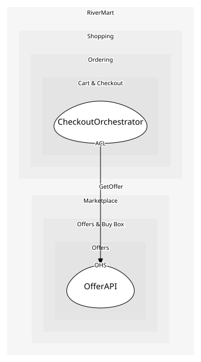

# OfferAPI
Seller-facing and internal offer endpoints

## Provides
| Name | Type | Internal | Pattern | Description | Schema | Raises |
| --- | --- | --- | --- | --- | --- | --- |
| PublishOffer | operation | no | open-host-service | Create or update an offer | [OfferPublished](../../index.md#schemas) | OfferPublished |
| GetOffer | operation | no | open-host-service | Read one offer with its current price and stock | [OfferRef](../../index.md#schemas) | - |

## Consumes
> No consumptions.
	
