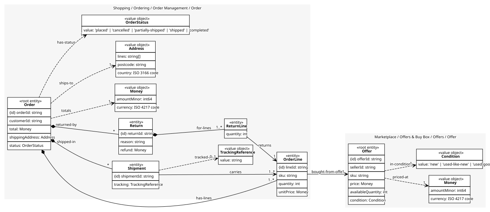
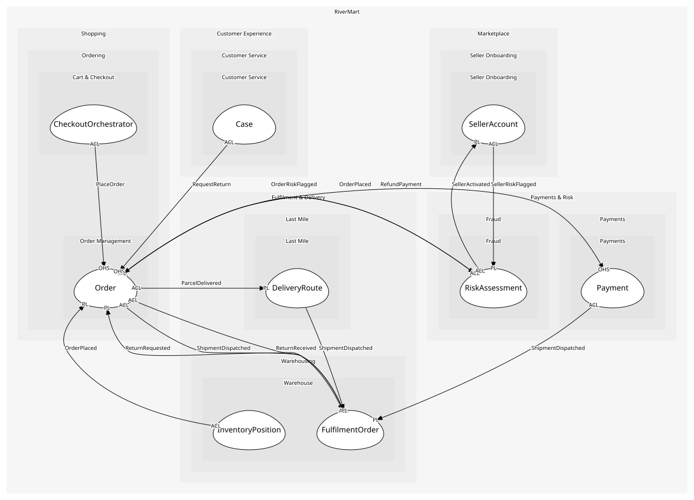

# Order
The order with its lines, the shipments that carry them and the returns that undo them. One aggregate because a return must check what was shipped, and a shipment what was ordered

## Entities and Value Objects
| Type | Name | Description | Attributes |
| --- | --- | --- | --- |
| Entity (Root) | **Order** | The customer-facing record of a purchase | **orderId**: `string`, customerId: `string`, total: `Money`, shippingAddress: `Address`, status: `OrderStatus` |
| Entity | OrderLine | One SKU, quantity and price as sold | **lineId**: `string`, sku: `string`, quantity: `int`, unitPrice: `Money` |
| Entity | Return | A request to send lines back, with what came back and what was refunded | **returnId**: `string`, reason: `string`, refund: `Money` |
| Entity | ReturnLine | One order line and the quantity returned from it | quantity: `int` |
| Entity | Shipment | A customer-visible group of lines travelling together. An entity here because the customer tracks it by order, not by warehouse | **shipmentId**: `string`, tracking: `TrackingReference` |
| Value Object | Money | An amount in a currency: minor units and an ISO 4217 code | amountMinor: `int64`, currency: `ISO 4217 code` |
| Value Object | Address | Where it ships; a value because the same address on two orders is the same place | lines: `string[]`, postcode: `string`, country: `ISO 3166 code` |
| Value Object | OrderStatus | placed, awaiting-stock, cancelled, partially-shipped, shipped, completed | value: `'placed' | 'awaiting-stock' | 'cancelled' | 'partially-shipped' | 'shipped' | 'completed'` |
| Value Object | TrackingReference | The carrier reference the customer sees | value: `string` |

## Relationships
| Source | Description | Target | Relation | Cardinality |
| --- | --- | --- | --- | --- |
| [Order](entities/order/index.md) | has-lines | Order - OrderLine | includes | 1..* |
| [OrderLine](entities/order_line/index.md) | bought-from-offer | Offer - Offer | references | 1 |
| [Offer](../../../offers/aggregates/offer/entities/offer/index.md) | priced-at | Offer - Money | uses | 1 |
| [Offer](../../../offers/aggregates/offer/entities/offer/index.md) | in-condition | Offer - Condition | uses | 1 |
| [Order](entities/order/index.md) | shipped-in | Order - Shipment | includes | * |
| [Shipment](entities/shipment/index.md) | carries | Order - OrderLine | references | 1..* |
| [Shipment](entities/shipment/index.md) | tracked-as | Order - TrackingReference | uses | 0..1 |
| [Order](entities/order/index.md) | returned-by | Order - Return | includes | * |
| [Return](entities/return/index.md) | for-lines | Order - ReturnLine | includes | 1..* |
| [ReturnLine](entities/return_line/index.md) | returns | Order - OrderLine | references | 1 |
| [Order](entities/order/index.md) | totals | Order - Money | uses | 1 |
| [Order](entities/order/index.md) | ships-to | Order - Address | uses | 1 |
| [Order](entities/order/index.md) | has-status | Order - OrderStatus | uses | 1 |

## Invariants
| Name | Description | Constrains |
| --- | --- | --- |
| TotalEqualsLines | The order total is the sum of its lines; a discrepancy is a bug, never rounding | Order.total, OrderLine |
| LineShippedOnce | A line belongs to at most one shipment | Shipment |
| ReturnWithinShipped | A return line's quantity never exceeds the quantity shipped for that line | ReturnLine.quantity |
| CancelOnlyBeforeShipment | An order with a shipment is returned, not cancelled | OrderStatus |

## Provides
| Name | Type | Internal | Pattern | Description | Schema | Raises |
| --- | --- | --- | --- | --- | --- | --- |
| OrderPlaced | event | no | published-language | A paid-for order exists | [OrderPlaced](../../index.md#schemas) | - |
| OrderCancelled | event | no | published-language | The order was cancelled before shipment | [OrderRef](../../index.md#schemas) | - |
| ReturnRequested | event | no | published-language | The customer wants to send lines back | [ReturnRequested](../../index.md#schemas) | - |
| OrderCompleted | event | no | published-language | Everything was delivered | [OrderRef](../../index.md#schemas) | - |
| PlaceOrder | operation | no | open-host-service | Create the order from a checked-out cart | [OrderPlaced](../../index.md#schemas) | OrderPlaced |
| CancelOrder | operation | no | open-host-service | Cancel before anything ships | [OrderRef](../../index.md#schemas) | OrderCancelled |
| RecordShipment | operation | yes | - | Attach a warehouse dispatch to the order as a customer-visible shipment | - | - |
| RequestReturn | operation | no | open-host-service | Open a return for some lines | [ReturnRequested](../../index.md#schemas) | ReturnRequested |
| CompleteOrder | operation | yes | - | Close the order once every shipment is delivered | - | OrderCompleted |
| HoldForStock | operation | yes | - | Put the order into awaiting-stock when no site could reserve for it; it is retried when stock is received or cancelled by the customer | - | - |

## Consumes

### OrderRiskFlagged [anti-corruption-layer]
An order scored above the threshold
- **Provider**: [RiskAssessment](../../../fraud/aggregates/risk_assessment/index.md)

### ShipmentDispatched [anti-corruption-layer]
A package left the dock
- **Provider**: [FulfilmentOrder](../../../warehouse/aggregates/fulfilment_order/index.md)

### ReturnReceived [anti-corruption-layer]
A return arrived and was graded
- **Provider**: [FulfilmentOrder](../../../warehouse/aggregates/fulfilment_order/index.md)

### StockShort [anti-corruption-layer]
No site could cover the order; it waits or is split
- **Provider**: [InventoryPosition](../../../warehouse/aggregates/inventory_position/index.md)

### RefundPayment [anti-corruption-layer]
Return money for a received return
- **Provider**: [Payment](../../../payments/aggregates/payment/index.md)

### ParcelDelivered [anti-corruption-layer]
Handed over with proof
- **Provider**: [DeliveryRoute](../../../last_mile/aggregates/delivery_route/index.md)

	
