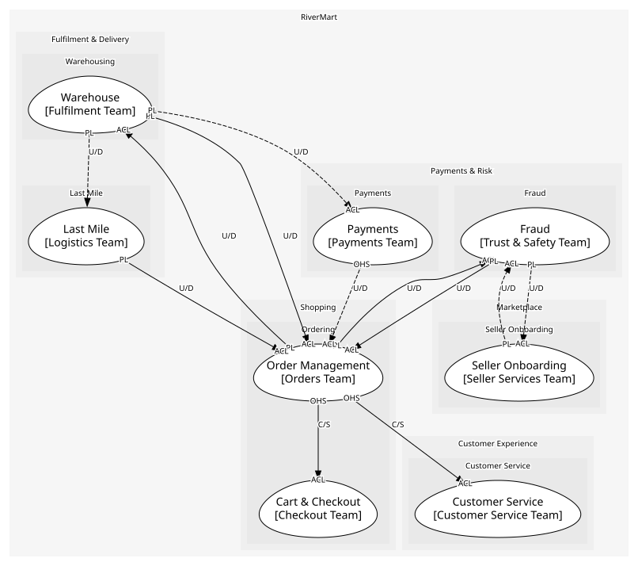
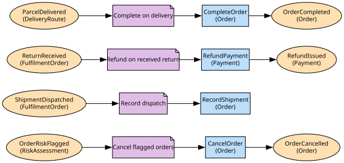

# Order Management
The order as the customer sees it: lines, shipments and returns

**Owned by:** Orders Team

## Serves
- [Shopping / Ordering](../../domains/shopping/subdomains/ordering/index.md) (supporting)

## Glossary
| Term | Definition | Aliases | Embodied by |
| --- | --- | --- | --- |
| **Order** | A paid-for purchase of one or more lines | - | Order |
| **Shipment** | A group of lines travelling together, as the customer tracks it | Package, Parcel | Shipment |
| **Return** | Lines sent back for a refund | RMA | Return |

## Aggregates

### [Order](aggregates/order/index.md)
The order with its lines, the shipments that carry them and the returns that undo them. One aggregate because a return must check what was shipped, and a shipment what was ordered

	
## Services

### [OrderAPI](services/order_api/index.md)
Read access to orders for the storefront and agents

## Schemas
| Name | Description | Attributes | Used by |
| --- | --- | --- | --- |
| OrderPlaced | The fact warehouse, fraud and payments react to | **orderId**: `string`, customerId: `string`, lines: `{sku, quantity}[]`, total: `Money` | OrderPlaced, PlaceOrder |
| OrderRef | - | **orderId**: `string` | OrderCancelled, OrderCompleted, CancelOrder, GetOrder |
| ReturnRequested | - | **returnId**: `string`, orderId: `string`, lines: `{lineId, quantity}[]` | ReturnRequested, RequestReturn |

## Policies

| Name | Description | On | Then |
| --- | --- | --- | --- |
| Cancel flagged orders | A flagged order is cancelled before the warehouse picks it | OrderRiskFlagged | CancelOrder |
| Record dispatch | A dispatched package appears on the order as a shipment | ShipmentDispatched | RecordShipment |
| Refund on received return | Money goes back once the warehouse has graded the return | ReturnReceived | RefundPayment |
| Complete on delivery | When the last package is delivered the order is done | ParcelDelivered | CompleteOrder |

## Context Relationships
| Upstream | Relationship | Downstream | Upstream Roles | Downstream Roles |
| --- | --- | --- | --- | --- |
| Order Management | customer-supplier | Cart & Checkout | open-host-service | anti-corruption-layer |
| Order Management | upstream-downstream | Warehouse | published-language | anti-corruption-layer |
| Warehouse | upstream-downstream | Order Management | published-language | anti-corruption-layer |
| Order Management | upstream-downstream | Fraud | published-language | anti-corruption-layer |
| Fraud | upstream-downstream | Order Management | published-language | anti-corruption-layer |
| Last Mile | upstream-downstream | Order Management | published-language | anti-corruption-layer |
| Order Management | customer-supplier | Customer Service | open-host-service | anti-corruption-layer |
| Seller Onboarding | upstream-downstream (implied) | Fraud | published-language | anti-corruption-layer |
| Fraud | upstream-downstream (implied) | Seller Onboarding | published-language | anti-corruption-layer |
| Payments | upstream-downstream (implied) | Order Management | open-host-service | anti-corruption-layer |
| Warehouse | upstream-downstream (implied) | Payments | published-language | anti-corruption-layer |
| Warehouse | upstream-downstream (implied) | Last Mile | published-language | - |

## Consumptions
| Consumer | Consumed As | Provider | Consumable | Provided As |
| --- | --- | --- | --- | --- |
| [Case](../customer_service/aggregates/case/index.md) | anti-corruption-layer | OrderAPI | GetOrder | open-host-service |
| [RiskAssessment](../fraud/aggregates/risk_assessment/index.md) | anti-corruption-layer | Order | OrderPlaced | published-language |
| [InventoryPosition](../warehouse/aggregates/inventory_position/index.md) | anti-corruption-layer | Order | OrderPlaced | published-language |
| [FulfilmentOrder](../warehouse/aggregates/fulfilment_order/index.md) | anti-corruption-layer | Order | ReturnRequested | published-language |
| [CheckoutOrchestrator](../cart_&_checkout/services/checkout_orchestrator/index.md) | anti-corruption-layer | Order | PlaceOrder | open-host-service |
| [Case](../customer_service/aggregates/case/index.md) | anti-corruption-layer | Order | RequestReturn | open-host-service |
| [Order](aggregates/order/index.md) | anti-corruption-layer | RiskAssessment | OrderRiskFlagged | published-language |
| [RiskAssessment](../fraud/aggregates/risk_assessment/index.md) | anti-corruption-layer | SellerAccount | SellerActivated | published-language |
| [SellerAccount](../seller_onboarding/aggregates/seller_account/index.md) | anti-corruption-layer | RiskAssessment | SellerRiskFlagged | published-language |
| [Order](aggregates/order/index.md) | anti-corruption-layer | FulfilmentOrder | ShipmentDispatched | published-language |
| [Order](aggregates/order/index.md) | anti-corruption-layer | FulfilmentOrder | ReturnReceived | published-language |
| [Order](aggregates/order/index.md) | anti-corruption-layer | Payment | RefundPayment | open-host-service |
| [Payment](../payments/aggregates/payment/index.md) | anti-corruption-layer | FulfilmentOrder | ShipmentDispatched | published-language |
| [Order](aggregates/order/index.md) | anti-corruption-layer | DeliveryRoute | ParcelDelivered | published-language |
| [DeliveryRoute](../last_mile/aggregates/delivery_route/index.md) | - | FulfilmentOrder | ShipmentDispatched | published-language |

