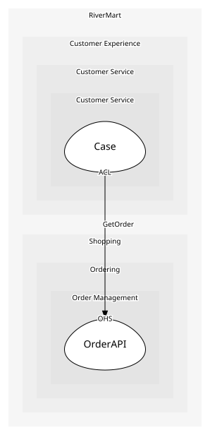

# OrderAPI
Read access to orders for the storefront and agents

## Provides
| Name | Type | Internal | Pattern | Description | Schema | Raises |
| --- | --- | --- | --- | --- | --- | --- |
| GetOrder | operation | no | open-host-service | Read one order with lines, shipments and returns | [OrderRef](../../index.md#schemas) | - |

## Consumes
> No consumptions.
	
