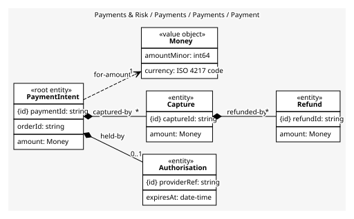
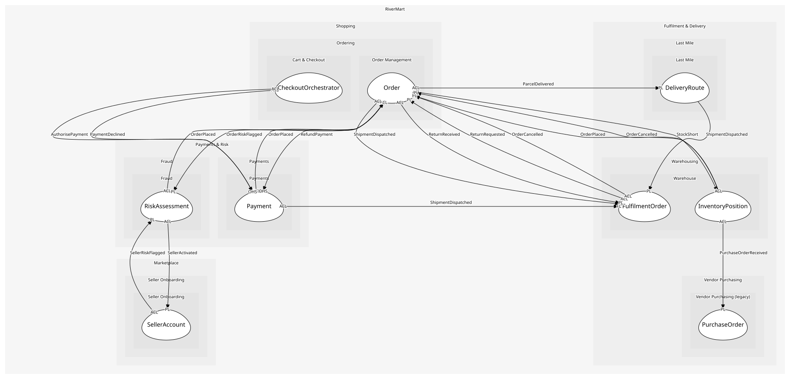

# Payment
An intent to take money and everything done against it. Captures and refunds must be checked against the authorisation, so they live inside

## Entities and Value Objects
| Type | Name | Description | Attributes |
| --- | --- | --- | --- |
| Entity (Root) | **PaymentIntent** | The amount RiverMart may take for an order | **paymentId**: `string`, orderId: `string`, amount: `Money` |
| Entity | Authorisation | The provider's hold on the customer's funds | **providerRef**: `string`, expiresAt: `date-time` |
| Entity | Capture | Money actually taken; one per shipment | **captureId**: `string`, amount: `Money` |
| Entity | Refund | Money given back against a capture | **refundId**: `string`, amount: `Money` |
| Value Object | Money | An amount in a currency: minor units and an ISO 4217 code | amountMinor: `int64`, currency: `ISO 4217 code` |

## Relationships
| Source | Description | Target | Relation | Cardinality |
| --- | --- | --- | --- | --- |
| [PaymentIntent](entities/payment_intent/index.md) | held-by | Payment - Authorisation | includes | 0..1 |
| [PaymentIntent](entities/payment_intent/index.md) | captured-by | Payment - Capture | includes | * |
| [Capture](entities/capture/index.md) | refunded-by | Payment - Refund | includes | * |
| [PaymentIntent](entities/payment_intent/index.md) | for-amount | Payment - Money | uses | 1 |

## Invariants
| Name | Description | Constrains |
| --- | --- | --- |
| CapturesWithinAuthorisation | Captures never sum to more than the authorised amount | Capture, Authorisation |
| RefundsWithinCapture | Refunds against a capture never exceed it | Refund |
| SingleCurrency | Every amount on one payment shares the intent's currency | Money |

## Provides
| Name | Type | Internal | Pattern | Description | Schema | Raises |
| --- | --- | --- | --- | --- | --- | --- |
| PaymentAuthorised | event | no | published-language | Funds are held; the order may be placed | [PaymentAuthorised](../../index.md#schemas) | - |
| PaymentDeclined | event | no | published-language | The provider refused; checkout shows an error | [PaymentRef](../../index.md#schemas) | - |
| PaymentCaptured | event | no | published-language | Money was taken for a dispatched shipment | [PaymentRef](../../index.md#schemas) | - |
| RefundIssued | event | no | published-language | Money went back to the customer | [PaymentRef](../../index.md#schemas) | - |
| AuthorisePayment | operation | no | open-host-service | Hold the cart total on the customer's instrument | [AuthorisePayment](../../index.md#schemas) | PaymentAuthorised, PaymentDeclined |
| CapturePayment | operation | no | open-host-service | Take the money for one shipment; charging at dispatch keeps cancelled orders free | [PaymentRef](../../index.md#schemas) | PaymentCaptured |
| RefundPayment | operation | no | open-host-service | Return money for a received return | [PaymentRef](../../index.md#schemas) | RefundIssued |
| AttachOrder | operation | yes | - | Record the order id on the payment intent so captures and refunds can find it | - | - |

## Consumes

### OrderPlaced [anti-corruption-layer]
A paid-for order exists
- **Provider**: [Order](../../../order_management/aggregates/order/index.md)

### ShipmentDispatched [anti-corruption-layer]
A package left the dock
- **Provider**: [FulfilmentOrder](../../../warehouse/aggregates/fulfilment_order/index.md)

	
