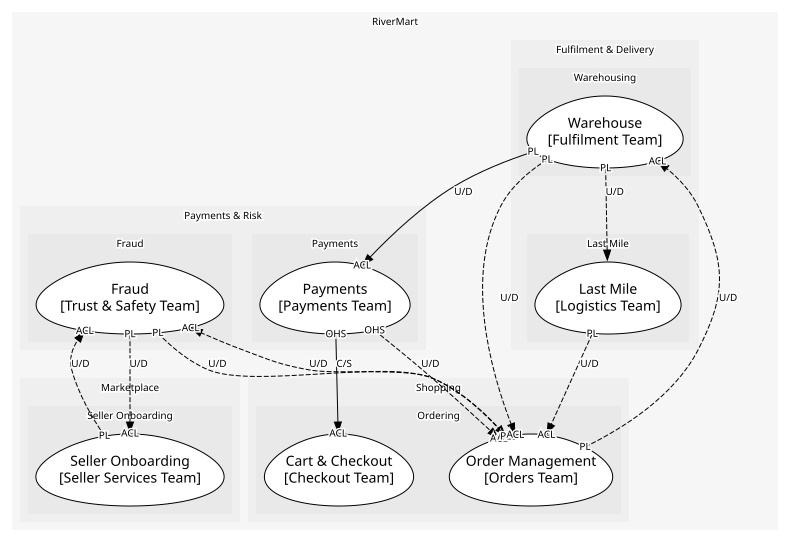
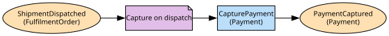

# Payments
Authorisation, capture and refund against a payment provider

**Owned by:** Payments Team

## Serves
- [Payments & Risk / Payments](../../domains/payments_&_risk/subdomains/payments/index.md) (generic)

## Glossary
| Term | Definition | Aliases | Embodied by |
| --- | --- | --- | --- |
| **Authorisation** | A hold on funds that expires if not captured; the customer sees it as pending | Auth, Hold | Authorisation |

## Aggregates

### [Payment](aggregates/payment/index.md)
An intent to take money and everything done against it. Captures and refunds must be checked against the authorisation, so they live inside

	
## Services
> No services.

## Schemas
| Name | Description | Attributes | Used by |
| --- | --- | --- | --- |
| PaymentAuthorised | - | **paymentId**: `string`, cartId: `string` | PaymentAuthorised |
| PaymentRef | - | **paymentId**: `string` | PaymentDeclined, PaymentCaptured, RefundIssued, CapturePayment, RefundPayment |
| AuthorisePayment | What checkout sends: the cart total and the customer's instrument token | cartId: `string`, amount: `Money`, instrumentToken: `string` | AuthorisePayment |

## Policies

| Name | Description | On | Then |
| --- | --- | --- | --- |
| Attach order to payment | Every placed order is linked to the hold that paid for it | OrderPlaced | AttachOrder |
| Capture on dispatch | Charge for each shipment as it leaves | ShipmentDispatched | CapturePayment |

## Context Relationships
| Upstream | Relationship | Downstream | Upstream Roles | Downstream Roles |
| --- | --- | --- | --- | --- |
| Payments | customer-supplier | Cart & Checkout | open-host-service | anti-corruption-layer |
| Payments | upstream-downstream | Order Management | open-host-service | anti-corruption-layer |
| Order Management | upstream-downstream | Payments | published-language | anti-corruption-layer |
| Warehouse | upstream-downstream | Payments | published-language | anti-corruption-layer |
| Fraud | upstream-downstream (implied) | Order Management | published-language | anti-corruption-layer |
| Order Management | upstream-downstream (implied) | Fraud | published-language | anti-corruption-layer |
| Seller Onboarding | upstream-downstream (implied) | Fraud | published-language | anti-corruption-layer |
| Fraud | upstream-downstream (implied) | Seller Onboarding | published-language | anti-corruption-layer |
| Warehouse | upstream-downstream (implied) | Order Management | published-language | anti-corruption-layer |
| Order Management | upstream-downstream (implied) | Warehouse | published-language | anti-corruption-layer |
| Vendor Purchasing (legacy) | upstream-downstream (implied) | Warehouse | published-language | anti-corruption-layer |
| Last Mile | upstream-downstream (implied) | Order Management | published-language | anti-corruption-layer |
| Warehouse | upstream-downstream (implied) | Last Mile | published-language | - |

## Consumptions
| Consumer | Consumed As | Provider | Consumable | Provided As |
| --- | --- | --- | --- | --- |
| [CheckoutOrchestrator](../cart_&_checkout/services/checkout_orchestrator/index.md) | anti-corruption-layer | Payment | PaymentDeclined | published-language |
| [CheckoutOrchestrator](../cart_&_checkout/services/checkout_orchestrator/index.md) | anti-corruption-layer | Payment | AuthorisePayment | open-host-service |
| [Order](../order_management/aggregates/order/index.md) | anti-corruption-layer | Payment | RefundPayment | open-host-service |
| [Payment](aggregates/payment/index.md) | anti-corruption-layer | Order | OrderPlaced | published-language |
| [Order](../order_management/aggregates/order/index.md) | anti-corruption-layer | RiskAssessment | OrderRiskFlagged | published-language |
| [RiskAssessment](../fraud/aggregates/risk_assessment/index.md) | anti-corruption-layer | Order | OrderPlaced | published-language |
| [RiskAssessment](../fraud/aggregates/risk_assessment/index.md) | anti-corruption-layer | SellerAccount | SellerActivated | published-language |
| [SellerAccount](../seller_onboarding/aggregates/seller_account/index.md) | anti-corruption-layer | RiskAssessment | SellerRiskFlagged | published-language |
| [Order](../order_management/aggregates/order/index.md) | anti-corruption-layer | FulfilmentOrder | ShipmentDispatched | published-language |
| [FulfilmentOrder](../warehouse/aggregates/fulfilment_order/index.md) | anti-corruption-layer | Order | ReturnRequested | published-language |
| [FulfilmentOrder](../warehouse/aggregates/fulfilment_order/index.md) | anti-corruption-layer | Order | OrderCancelled | published-language |
| [Order](../order_management/aggregates/order/index.md) | anti-corruption-layer | FulfilmentOrder | ReturnReceived | published-language |
| [Order](../order_management/aggregates/order/index.md) | anti-corruption-layer | InventoryPosition | StockShort | published-language |
| [InventoryPosition](../warehouse/aggregates/inventory_position/index.md) | anti-corruption-layer | Order | OrderPlaced | published-language |
| [InventoryPosition](../warehouse/aggregates/inventory_position/index.md) | anti-corruption-layer | Order | OrderCancelled | published-language |
| [InventoryPosition](../warehouse/aggregates/inventory_position/index.md) | anti-corruption-layer | PurchaseOrder | PurchaseOrderReceived | published-language |
| [Order](../order_management/aggregates/order/index.md) | anti-corruption-layer | DeliveryRoute | ParcelDelivered | published-language |
| [DeliveryRoute](../last_mile/aggregates/delivery_route/index.md) | - | FulfilmentOrder | ShipmentDispatched | published-language |
| [Payment](aggregates/payment/index.md) | anti-corruption-layer | FulfilmentOrder | ShipmentDispatched | published-language |

