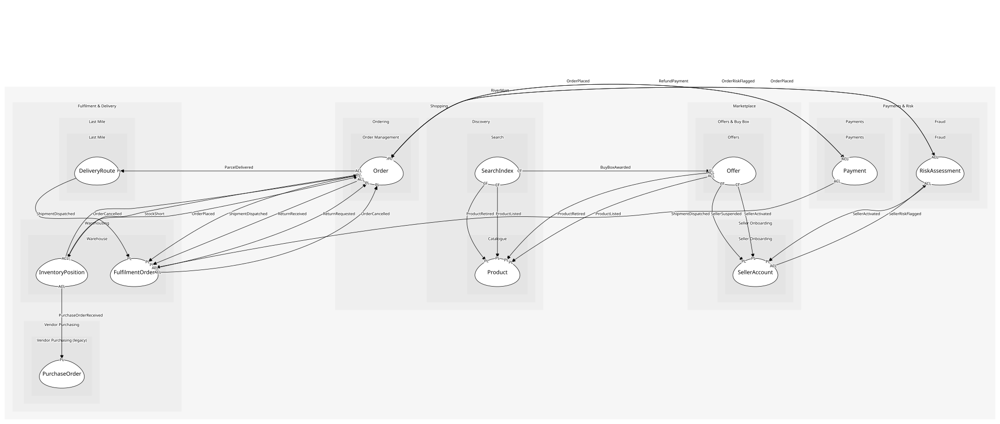

# SearchIndex
The searchable documents. A projection: it holds copies, never the truth

## Entities and Value Objects
| Type | Name | Description | Attributes |
| --- | --- | --- | --- |
| Entity (Root) | **SearchDocument** | One indexed product with the fields ranking needs | **productId**: `string`, buyBoxPriceMinor: `int64`, primeEligible: `boolean` |

## Relationships

## Invariants
> No invariants.

## Provides
| Name | Type | Internal | Pattern | Description | Schema | Raises |
| --- | --- | --- | --- | --- | --- | --- |
| DocumentIndexed | event | yes | - | A document was (re)written into the index | - | - |
| IndexProduct | operation | yes | - | Write or refresh a product's document | - | DocumentIndexed |
| RemoveDocument | operation | yes | - | Drop a retired product from the index | - | - |

## Consumes

### ProductListed [conformist]
A product joined the catalogue
- **Provider**: [Product](../../../catalogue/aggregates/product/index.md)

### ProductRetired [conformist]
A product was withdrawn; offers and index entries must go
- **Provider**: [Product](../../../catalogue/aggregates/product/index.md)

### BuyBoxAwarded [conformist]
The offer shown by default for a SKU changed
- **Provider**: [Offer](../../../offers/aggregates/offer/index.md)

	
