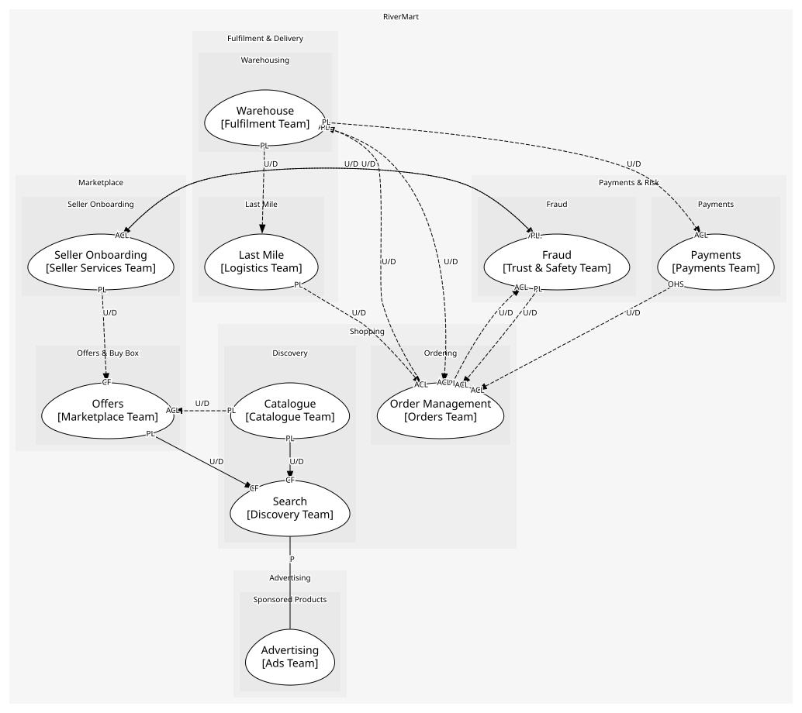
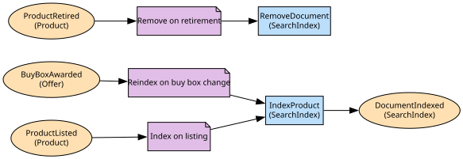

# Search
The index and ranking that turns a query into a results page

**Owned by:** Discovery Team

## Serves
- [Shopping / Discovery](../../domains/shopping/subdomains/discovery/index.md) (core)

## Glossary
| Term | Definition | Aliases | Embodied by |
| --- | --- | --- | --- |
| **Relevance** | How well a document answers the query, before price and delivery are weighed | - | Ranker |

## Aggregates

### [SearchIndex](aggregates/search_index/index.md)
The searchable documents. A projection: it holds copies, never the truth

	
## Services

### [Ranker](services/ranker/index.md)
Orders candidates by relevance, price and delivery promise; spans every document so it is a domain service

### [SearchAPI](services/search_api/index.md)
The results page endpoint

## Schemas
> No schemas.

## Policies

| Name | Description | On | Then |
| --- | --- | --- | --- |
| Index on listing | Every listed product becomes searchable | ProductListed | IndexProduct |
| Remove on retirement | A retired product disappears from results | ProductRetired | RemoveDocument |
| Reindex on buy box change | Results show the buy box price, so it must be refreshed | BuyBoxAwarded | IndexProduct |

## Context Relationships
| Upstream | Relationship | Downstream | Upstream Roles | Downstream Roles |
| --- | --- | --- | --- | --- |
| Catalogue | upstream-downstream | Search | published-language | conformist |
| Offers | upstream-downstream | Search | published-language | conformist |
| Search | partnership | Advertising | - | - |
| Catalogue | upstream-downstream (implied) | Advertising | open-host-service | conformist |
| Catalogue | upstream-downstream (implied) | Offers | published-language | anti-corruption-layer |
| Seller Onboarding | upstream-downstream (implied) | Offers | published-language | conformist |
| Fraud | upstream-downstream (implied) | Seller Onboarding | published-language | anti-corruption-layer |
| Order Management | upstream-downstream (implied) | Fraud | published-language | anti-corruption-layer |
| Fraud | upstream-downstream (implied) | Order Management | published-language | anti-corruption-layer |
| Warehouse | upstream-downstream (implied) | Order Management | published-language | anti-corruption-layer |
| Order Management | upstream-downstream (implied) | Warehouse | published-language | anti-corruption-layer |
| Vendor Purchasing (legacy) | upstream-downstream (implied) | Warehouse | published-language | anti-corruption-layer |
| Payments | upstream-downstream (implied) | Order Management | open-host-service | anti-corruption-layer |
| Order Management | upstream-downstream (implied) | Payments | published-language | anti-corruption-layer |
| Warehouse | upstream-downstream (implied) | Payments | published-language | anti-corruption-layer |
| Last Mile | upstream-downstream (implied) | Order Management | published-language | anti-corruption-layer |
| Warehouse | upstream-downstream (implied) | Last Mile | published-language | - |
| Seller Onboarding | upstream-downstream (implied) | Fraud | published-language | anti-corruption-layer |

## Consumptions
| Consumer | Consumed As | Provider | Consumable | Provided As |
| --- | --- | --- | --- | --- |
| [SearchAPI](services/search_api/index.md) | conformist | AdsAPI | GetSponsoredResults | open-host-service |
| [AdsAPI](../advertising/services/ads_api/index.md) | conformist | CatalogueAPI | GetProduct | open-host-service |
| [SearchAPI](services/search_api/index.md) | conformist | AdsAPI | RecordAdClick | open-host-service |
| [SearchIndex](aggregates/search_index/index.md) | conformist | Product | ProductListed | published-language |
| [SearchIndex](aggregates/search_index/index.md) | conformist | Product | ProductRetired | published-language |
| [SearchIndex](aggregates/search_index/index.md) | conformist | Offer | BuyBoxAwarded | published-language |
| [Offer](../offers/aggregates/offer/index.md) | anti-corruption-layer | Product | ProductListed | published-language |
| [Offer](../offers/aggregates/offer/index.md) | anti-corruption-layer | Product | ProductRetired | published-language |
| [Offer](../offers/aggregates/offer/index.md) | conformist | SellerAccount | SellerActivated | published-language |
| [SellerAccount](../seller_onboarding/aggregates/seller_account/index.md) | anti-corruption-layer | RiskAssessment | SellerRiskFlagged | published-language |
| [RiskAssessment](../fraud/aggregates/risk_assessment/index.md) | anti-corruption-layer | Order | OrderPlaced | published-language |
| [Order](../order_management/aggregates/order/index.md) | anti-corruption-layer | RiskAssessment | OrderRiskFlagged | published-language |
| [Order](../order_management/aggregates/order/index.md) | anti-corruption-layer | FulfilmentOrder | ShipmentDispatched | published-language |
| [FulfilmentOrder](../warehouse/aggregates/fulfilment_order/index.md) | anti-corruption-layer | Order | ReturnRequested | published-language |
| [FulfilmentOrder](../warehouse/aggregates/fulfilment_order/index.md) | anti-corruption-layer | Order | OrderCancelled | published-language |
| [Order](../order_management/aggregates/order/index.md) | anti-corruption-layer | FulfilmentOrder | ReturnReceived | published-language |
| [Order](../order_management/aggregates/order/index.md) | anti-corruption-layer | InventoryPosition | StockShort | published-language |
| [InventoryPosition](../warehouse/aggregates/inventory_position/index.md) | anti-corruption-layer | Order | OrderPlaced | published-language |
| [InventoryPosition](../warehouse/aggregates/inventory_position/index.md) | anti-corruption-layer | Order | OrderCancelled | published-language |
| [InventoryPosition](../warehouse/aggregates/inventory_position/index.md) | anti-corruption-layer | PurchaseOrder | PurchaseOrderReceived | published-language |
| [Order](../order_management/aggregates/order/index.md) | anti-corruption-layer | Payment | RefundPayment | open-host-service |
| [Payment](../payments/aggregates/payment/index.md) | anti-corruption-layer | Order | OrderPlaced | published-language |
| [Payment](../payments/aggregates/payment/index.md) | anti-corruption-layer | FulfilmentOrder | ShipmentDispatched | published-language |
| [Order](../order_management/aggregates/order/index.md) | anti-corruption-layer | DeliveryRoute | ParcelDelivered | published-language |
| [DeliveryRoute](../last_mile/aggregates/delivery_route/index.md) | - | FulfilmentOrder | ShipmentDispatched | published-language |
| [RiskAssessment](../fraud/aggregates/risk_assessment/index.md) | anti-corruption-layer | SellerAccount | SellerActivated | published-language |
| [Offer](../offers/aggregates/offer/index.md) | conformist | SellerAccount | SellerSuspended | published-language |

