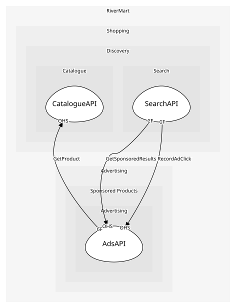

# SearchAPI
The results page endpoint

## Provides
| Name | Type | Internal | Pattern | Description | Schema | Raises |
| --- | --- | --- | --- | --- | --- | --- |
| SearchProducts | operation | no | open-host-service | Query → ranked page, with sponsored slots merged in | - | - |

## Consumes

### GetSponsoredResults [conformist]
Sponsored slots for a query, merged into organic results by Search
- **Provider**: [AdsAPI](../../../advertising/services/ads_api/index.md)

	
