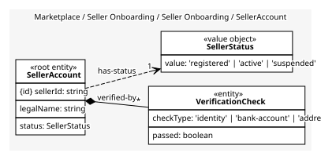
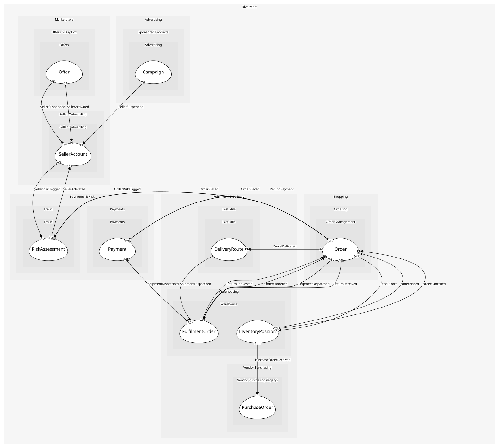

# SellerAccount
A third-party seller and its verification history

## Entities and Value Objects
| Type | Name | Description | Attributes |
| --- | --- | --- | --- |
| Entity (Root) | **SellerAccount** | The legal entity selling on RiverMart | **sellerId**: `string`, legalName: `string`, status: `SellerStatus` |
| Entity | VerificationCheck | One identity or bank check run on the seller; kept for audit | checkType: `'identity' | 'bank-account' | 'address'`, passed: `boolean` |
| Value Object | SellerStatus | registered, active or suspended | value: `'registered' | 'active' | 'suspended'` |

## Relationships
| Source | Description | Target | Relation | Cardinality |
| --- | --- | --- | --- | --- |
| [SellerAccount](entities/seller_account/index.md) | verified-by | SellerAccount - VerificationCheck | includes | * |
| [SellerAccount](entities/seller_account/index.md) | has-status | SellerAccount - SellerStatus | uses | 1 |

## Invariants
| Name | Description | Constrains |
| --- | --- | --- |
| ActiveOnlyAfterChecks | A seller becomes active only when identity and bank checks both passed | SellerStatus, VerificationCheck |

## Provides
| Name | Type | Internal | Pattern | Description | Schema | Raises |
| --- | --- | --- | --- | --- | --- | --- |
| SellerRegistered | event | yes | - | A seller signed up; checks are still pending | - | - |
| SellerActivated | event | no | published-language | A seller may now publish offers | [SellerRef](../../index.md#schemas) | - |
| SellerSuspended | event | no | published-language | A seller lost the right to sell; offers and campaigns must stop | [SellerRef](../../index.md#schemas) | - |
| VerifySeller | operation | yes | - | Run the checks and activate on success | - | SellerActivated |
| SuspendSeller | operation | no | open-host-service | Suspend a seller; used by Trust & Safety through the policy below | [SellerRef](../../index.md#schemas) | SellerSuspended |

## Consumes

### SellerRiskFlagged [anti-corruption-layer]
A seller looks like a bad actor
- **Provider**: [RiskAssessment](../../../fraud/aggregates/risk_assessment/index.md)

	
