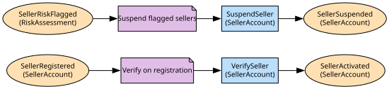

# Seller Onboarding
Seller accounts, verification and suspension

**Owned by:** Seller Services Team

## Serves
- [Marketplace / Seller Onboarding](../../domains/marketplace/subdomains/seller_onboarding/index.md) (supporting)

## Glossary
| Term | Definition | Aliases | Embodied by |
| --- | --- | --- | --- |
| **Seller** | A third party selling through RiverMart under its own name | Merchant, 3P | SellerAccount |
| **Vendor** | Not a seller. A wholesale supplier to first-party retail, handled by Vendor Purchasing; the two accounts were never unified and will not be | - | Vendor Purchasing (legacy) |

## Aggregates

### [SellerAccount](aggregates/seller_account/index.md)
A third-party seller and its verification history

	
## Services

### [SellerCentralAPI](services/seller_central_api/index.md)
The seller sign-up endpoints

## Schemas
| Name | Description | Attributes | Used by |
| --- | --- | --- | --- |
| SellerRef | - | **sellerId**: `string` | SellerActivated, SellerSuspended, SuspendSeller |

## Policies

| Name | Description | On | Then |
| --- | --- | --- | --- |
| Verify on registration | Every new seller is checked before selling | SellerRegistered | VerifySeller |
| Suspend flagged sellers | Trust & Safety's verdict suspends the seller pending review | SellerRiskFlagged | SuspendSeller |

## Context Relationships
| Upstream | Relationship | Downstream | Upstream Roles | Downstream Roles |
| --- | --- | --- | --- | --- |
| Seller Onboarding | upstream-downstream | Offers | published-language | conformist |
| Seller Onboarding | upstream-downstream | Fraud | published-language | anti-corruption-layer |
| Fraud | upstream-downstream | Seller Onboarding | published-language | anti-corruption-layer |
| Seller Onboarding | upstream-downstream | Advertising | published-language | conformist |
| Vendor Purchasing (legacy) | separate-ways | Seller Onboarding | - | - |
| Order Management | upstream-downstream (implied) | Fraud | published-language | anti-corruption-layer |
| Fraud | upstream-downstream (implied) | Order Management | published-language | anti-corruption-layer |
| Warehouse | upstream-downstream (implied) | Order Management | published-language | anti-corruption-layer |
| Order Management | upstream-downstream (implied) | Warehouse | published-language | anti-corruption-layer |
| Vendor Purchasing (legacy) | upstream-downstream (implied) | Warehouse | published-language | anti-corruption-layer |
| Payments | upstream-downstream (implied) | Order Management | open-host-service | anti-corruption-layer |
| Order Management | upstream-downstream (implied) | Payments | published-language | anti-corruption-layer |
| Warehouse | upstream-downstream (implied) | Payments | published-language | anti-corruption-layer |
| Last Mile | upstream-downstream (implied) | Order Management | published-language | anti-corruption-layer |
| Warehouse | upstream-downstream (implied) | Last Mile | published-language | - |

## Consumptions
| Consumer | Consumed As | Provider | Consumable | Provided As |
| --- | --- | --- | --- | --- |
| [Offer](../offers/aggregates/offer/index.md) | conformist | SellerAccount | SellerActivated | published-language |
| [RiskAssessment](../fraud/aggregates/risk_assessment/index.md) | anti-corruption-layer | SellerAccount | SellerActivated | published-language |
| [Offer](../offers/aggregates/offer/index.md) | conformist | SellerAccount | SellerSuspended | published-language |
| [Campaign](../advertising/aggregates/campaign/index.md) | conformist | SellerAccount | SellerSuspended | published-language |
| [SellerAccount](aggregates/seller_account/index.md) | anti-corruption-layer | RiskAssessment | SellerRiskFlagged | published-language |
| [RiskAssessment](../fraud/aggregates/risk_assessment/index.md) | anti-corruption-layer | Order | OrderPlaced | published-language |
| [Order](../order_management/aggregates/order/index.md) | anti-corruption-layer | RiskAssessment | OrderRiskFlagged | published-language |
| [Order](../order_management/aggregates/order/index.md) | anti-corruption-layer | FulfilmentOrder | ShipmentDispatched | published-language |
| [FulfilmentOrder](../warehouse/aggregates/fulfilment_order/index.md) | anti-corruption-layer | Order | ReturnRequested | published-language |
| [FulfilmentOrder](../warehouse/aggregates/fulfilment_order/index.md) | anti-corruption-layer | Order | OrderCancelled | published-language |
| [Order](../order_management/aggregates/order/index.md) | anti-corruption-layer | FulfilmentOrder | ReturnReceived | published-language |
| [Order](../order_management/aggregates/order/index.md) | anti-corruption-layer | InventoryPosition | StockShort | published-language |
| [InventoryPosition](../warehouse/aggregates/inventory_position/index.md) | anti-corruption-layer | Order | OrderPlaced | published-language |
| [InventoryPosition](../warehouse/aggregates/inventory_position/index.md) | anti-corruption-layer | Order | OrderCancelled | published-language |
| [InventoryPosition](../warehouse/aggregates/inventory_position/index.md) | anti-corruption-layer | PurchaseOrder | PurchaseOrderReceived | published-language |
| [Order](../order_management/aggregates/order/index.md) | anti-corruption-layer | Payment | RefundPayment | open-host-service |
| [Payment](../payments/aggregates/payment/index.md) | anti-corruption-layer | Order | OrderPlaced | published-language |
| [Payment](../payments/aggregates/payment/index.md) | anti-corruption-layer | FulfilmentOrder | ShipmentDispatched | published-language |
| [Order](../order_management/aggregates/order/index.md) | anti-corruption-layer | DeliveryRoute | ParcelDelivered | published-language |
| [DeliveryRoute](../last_mile/aggregates/delivery_route/index.md) | - | FulfilmentOrder | ShipmentDispatched | published-language |

