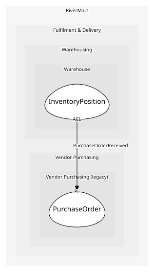

# PurchaseOrder
As far as anyone can tell, the central table of the legacy system

## Entities and Value Objects
| Type | Name | Description | Attributes |
| --- | --- | --- | --- |
| Entity (Root) | **PurchaseOrder** | An order placed with a wholesale vendor | **poNumber**: `string`, vendorCode: `string` |

## Relationships

## Invariants
> No invariants.

## Provides
| Name | Type | Internal | Pattern | Description | Schema | Raises |
| --- | --- | --- | --- | --- | --- | --- |
| PurchaseOrderReceived | event | no | published-language | Vendor stock arrived at a site (a nightly batch, not real time) | [PurchaseOrderReceived](../../index.md#schemas) | - |

## Consumes
> No consumptions.
	
