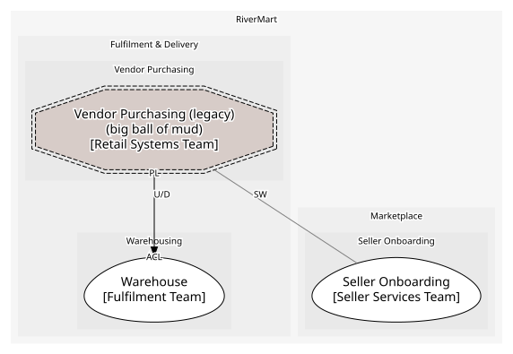

# Vendor Purchasing (legacy)
> ⚠️ **Big ball of mud.** This context's model is not coherent; neighbours should protect themselves with an anti-corruption layer.

The 2009 purchasing system for first-party stock. Batch jobs, shared tables, no owner of the schema

**Owned by:** Retail Systems Team

## Serves
- [Fulfilment & Delivery / Vendor Purchasing](../../domains/fulfilment_&_delivery/subdomains/vendor_purchasing/index.md) (supporting)

## Glossary
> No glossary terms.

## Aggregates

### [PurchaseOrder](aggregates/purchase_order/index.md)
As far as anyone can tell, the central table of the legacy system

	
## Services
> No services.

## Schemas
| Name | Description | Attributes | Used by |
| --- | --- | --- | --- |
| PurchaseOrderReceived | The nightly export the warehouse reads | **poNumber**: `string`, lines: `{sku, quantity}[]` | PurchaseOrderReceived |

## Policies
> No policies.

## Context Relationships
| Upstream | Relationship | Downstream | Upstream Roles | Downstream Roles |
| --- | --- | --- | --- | --- |
| Vendor Purchasing (legacy) | upstream-downstream | Warehouse | published-language | anti-corruption-layer |
| Vendor Purchasing (legacy) | separate-ways | Seller Onboarding | - | - |

## Consumptions
| Consumer | Consumed As | Provider | Consumable | Provided As |
| --- | --- | --- | --- | --- |
| [InventoryPosition](../warehouse/aggregates/inventory_position/index.md) | anti-corruption-layer | PurchaseOrder | PurchaseOrderReceived | published-language |

