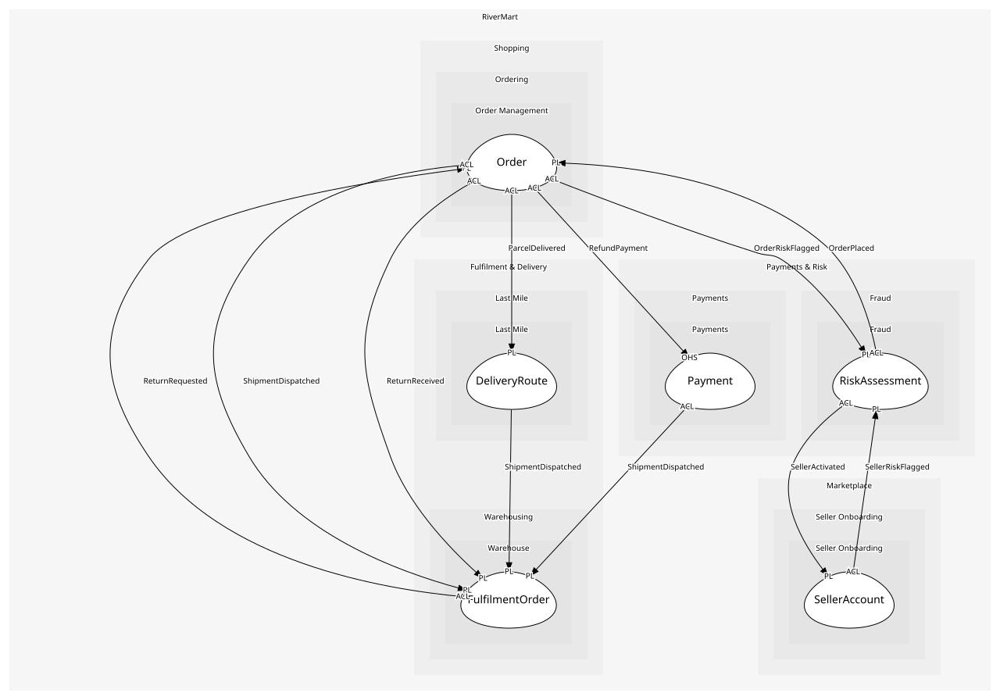

# FulfilmentOrder
The warehouse's view of an order: what to pick, how to pack, when it left

## Entities and Value Objects
| Type | Name | Description | Attributes |
| --- | --- | --- | --- |
| Entity (Root) | **FulfilmentOrder** | Work to do for one order at one site | **fulfilmentOrderId**: `string`, orderId: `string` |
| Entity | Package | A box that leaves the dock | **packageId**: `string`, label: `TrackingLabel` |
| Entity | PickTask | One SKU and quantity for a picker to collect | sku: `string`, quantity: `int`, status: `'pending' | 'picked' | 'voided'` |
| Value Object | TrackingLabel | Carrier barcode and scan vocabulary. Part of the kernel shared with Last Mile: one library, one format | barcode: `string`, carrier: `string` |

## Relationships
| Source | Description | Target | Relation | Cardinality |
| --- | --- | --- | --- | --- |
| [InventoryPosition](../inventory_position/entities/inventory_position/index.md) | reserved-by | InventoryPosition - Reservation | includes | * |
| [InventoryPosition](../inventory_position/entities/inventory_position/index.md) | stored-in | InventoryPosition - Bin | uses | 1..* |
| [FulfilmentOrder](entities/fulfilment_order/index.md) | picks | FulfilmentOrder - PickTask | includes | 1..* |
| [FulfilmentOrder](entities/fulfilment_order/index.md) | packed-into | FulfilmentOrder - Package | includes | * |
| [Package](entities/package/index.md) | packs | FulfilmentOrder - PickTask | references | 1..* |
| [Package](entities/package/index.md) | labelled | FulfilmentOrder - TrackingLabel | uses | 1 |
| [FulfilmentOrder](entities/fulfilment_order/index.md) | fulfils | Order - Order | references | 1 |
| [Order](../../../order_management/aggregates/order/entities/order/index.md) | has-lines | Order - OrderLine | includes | 1..* |
| [OrderLine](../../../order_management/aggregates/order/entities/order_line/index.md) | bought-from-offer | Offer - Offer | references | 1 |
| [Offer](../../../offers/aggregates/offer/entities/offer/index.md) | priced-at | Offer - Money | uses | 1 |
| [Offer](../../../offers/aggregates/offer/entities/offer/index.md) | in-condition | Offer - Condition | uses | 1 |
| [Order](../../../order_management/aggregates/order/entities/order/index.md) | shipped-in | Order - Shipment | includes | * |
| [Shipment](../../../order_management/aggregates/order/entities/shipment/index.md) | carries | Order - OrderLine | references | 1..* |
| [Shipment](../../../order_management/aggregates/order/entities/shipment/index.md) | tracked-as | Order - TrackingReference | uses | 0..1 |
| [Order](../../../order_management/aggregates/order/entities/order/index.md) | returned-by | Order - Return | includes | * |
| [Return](../../../order_management/aggregates/order/entities/return/index.md) | for-lines | Order - ReturnLine | includes | 1..* |
| [ReturnLine](../../../order_management/aggregates/order/entities/return_line/index.md) | returns | Order - OrderLine | references | 1 |
| [Order](../../../order_management/aggregates/order/entities/order/index.md) | totals | Order - Money | uses | 1 |
| [Order](../../../order_management/aggregates/order/entities/order/index.md) | ships-to | Order - Address | uses | 1 |
| [Order](../../../order_management/aggregates/order/entities/order/index.md) | has-status | Order - OrderStatus | uses | 1 |

## Invariants
| Name | Description | Constrains |
| --- | --- | --- |
| DispatchOnlyWhenPicked | A package is dispatched only when every pick task packed into it has status picked | Package, PickTask.status |

## Provides
| Name | Type | Internal | Pattern | Description | Schema | Raises |
| --- | --- | --- | --- | --- | --- | --- |
| ShipmentDispatched | event | no | published-language | A package left the dock | [ShipmentDispatched](../../index.md#schemas) | - |
| ReturnReceived | event | no | published-language | A return arrived and was graded | [ReturnReceived](../../index.md#schemas) | - |
| CreatePickTasks | operation | yes | - | Turn a reservation into work for pickers | - | - |
| VoidPickTasks | operation | yes | - | Mark every pending pick task of a cancelled order voided so nothing is picked or packed for it | - | - |
| Dispatch | operation | yes | - | Hand a packed package to the carrier | - | ShipmentDispatched |
| ReceiveReturn | operation | yes | - | Grade a returned item and restock or scrap it | - | ReturnReceived |

## Consumes

### ReturnRequested [anti-corruption-layer]
The customer wants to send lines back
- **Provider**: [Order](../../../order_management/aggregates/order/index.md)

### OrderCancelled [anti-corruption-layer]
The order was cancelled before shipment
- **Provider**: [Order](../../../order_management/aggregates/order/index.md)

	
