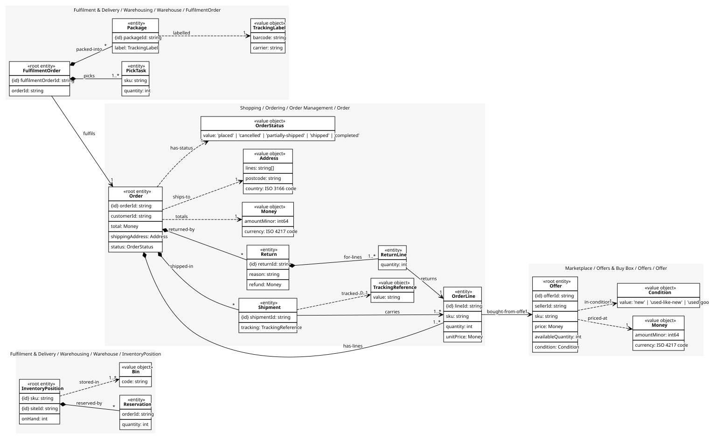
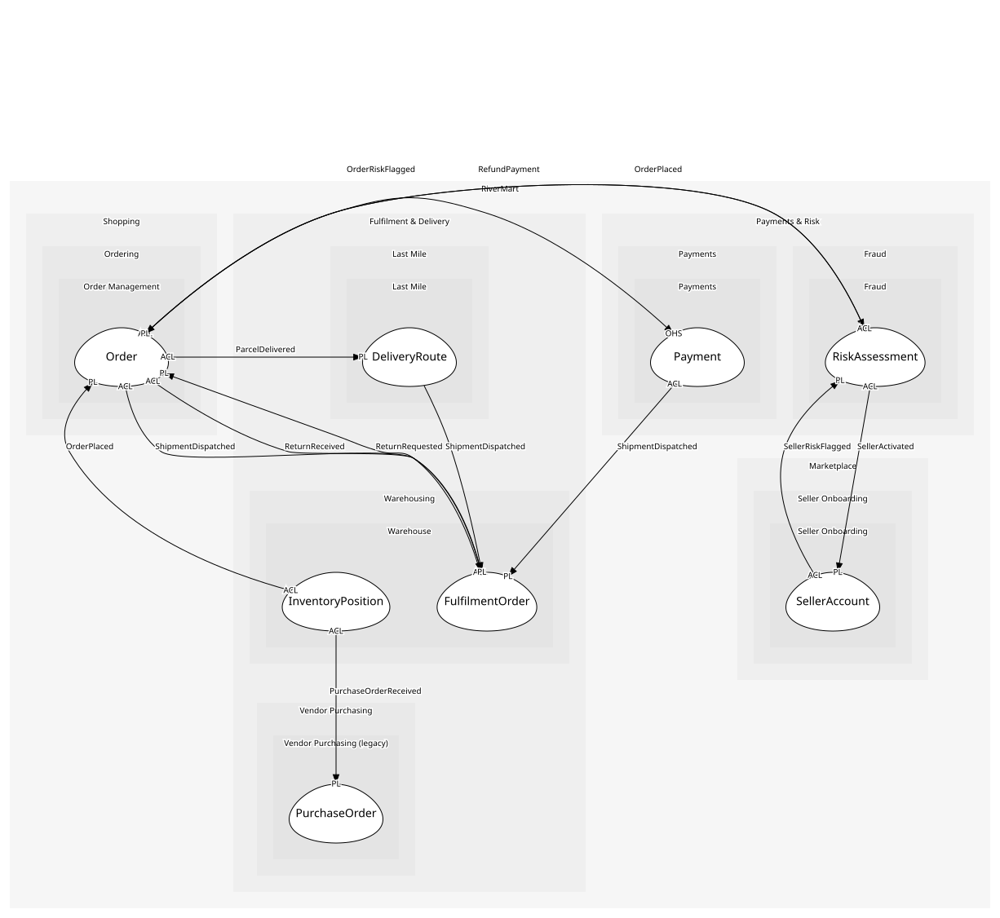

# InventoryPosition
How much of a SKU one site holds and how much is promised

## Entities and Value Objects
| Type | Name | Description | Attributes |
| --- | --- | --- | --- |
| Entity (Root) | **InventoryPosition** | SKU at site | **sku**: `string`, **siteId**: `string`, onHand: `int` |
| Entity | Reservation | Stock promised to an order but not yet picked | orderId: `string`, quantity: `int` |
| Value Object | Bin | Aisle, shelf, slot | code: `string` |

## Relationships
| Source | Description | Target | Relation | Cardinality |
| --- | --- | --- | --- | --- |
| [InventoryPosition](entities/inventory_position/index.md) | reserved-by | InventoryPosition - Reservation | includes | * |
| [InventoryPosition](entities/inventory_position/index.md) | stored-in | InventoryPosition - Bin | uses | 1..* |
| [FulfilmentOrder](../fulfilment_order/entities/fulfilment_order/index.md) | picks | FulfilmentOrder - PickTask | includes | 1..* |
| [FulfilmentOrder](../fulfilment_order/entities/fulfilment_order/index.md) | packed-into | FulfilmentOrder - Package | includes | * |
| [Package](../fulfilment_order/entities/package/index.md) | labelled | FulfilmentOrder - TrackingLabel | uses | 1 |
| [FulfilmentOrder](../fulfilment_order/entities/fulfilment_order/index.md) | fulfils | Order - Order | references | 1 |
| [Order](../../../order_management/aggregates/order/entities/order/index.md) | has-lines | Order - OrderLine | includes | 1..* |
| [OrderLine](../../../order_management/aggregates/order/entities/order_line/index.md) | bought-from-offer | Offer - Offer | references | 1 |
| [Offer](../../../offers/aggregates/offer/entities/offer/index.md) | priced-at | Offer - Money | uses | 1 |
| [Offer](../../../offers/aggregates/offer/entities/offer/index.md) | in-condition | Offer - Condition | uses | 1 |
| [Order](../../../order_management/aggregates/order/entities/order/index.md) | shipped-in | Order - Shipment | includes | * |
| [Shipment](../../../order_management/aggregates/order/entities/shipment/index.md) | carries | Order - OrderLine | references | 1..* |
| [Shipment](../../../order_management/aggregates/order/entities/shipment/index.md) | tracked-as | Order - TrackingReference | uses | 0..1 |
| [Order](../../../order_management/aggregates/order/entities/order/index.md) | returned-by | Order - Return | includes | * |
| [Return](../../../order_management/aggregates/order/entities/return/index.md) | for-lines | Order - ReturnLine | includes | 1..* |
| [ReturnLine](../../../order_management/aggregates/order/entities/return_line/index.md) | returns | Order - OrderLine | references | 1 |
| [Order](../../../order_management/aggregates/order/entities/order/index.md) | totals | Order - Money | uses | 1 |
| [Order](../../../order_management/aggregates/order/entities/order/index.md) | ships-to | Order - Address | uses | 1 |
| [Order](../../../order_management/aggregates/order/entities/order/index.md) | has-status | Order - OrderStatus | uses | 1 |

## Invariants
| Name | Description | Constrains |
| --- | --- | --- |
| ReservedWithinOnHand | Reservations never exceed stock on hand; overselling is a broken promise | InventoryPosition.onHand, Reservation |

## Provides
| Name | Type | Internal | Pattern | Description | Schema | Raises |
| --- | --- | --- | --- | --- | --- | --- |
| StockReserved | event | no | published-language | Stock is held for an order at a site | [StockReserved](../../index.md#schemas) | - |
| StockShort | event | no | published-language | No site could cover the order; it waits or is split | [StockReserved](../../index.md#schemas) | - |
| StockReceived | event | yes | - | A vendor delivery was booked in | - | - |
| ReserveStock | operation | no | open-host-service | Hold stock for an order, choosing the nearest site that has it | [StockReserved](../../index.md#schemas) | StockReserved, StockShort |
| ReceiveStock | operation | yes | - | Book in a vendor delivery | - | StockReceived |

## Consumes

### OrderPlaced [anti-corruption-layer]
A paid-for order exists
- **Provider**: [Order](../../../order_management/aggregates/order/index.md)

### PurchaseOrderReceived [anti-corruption-layer]
Vendor stock arrived at a site (a nightly batch, not real time)
- **Provider**: [PurchaseOrder](../../../vendor_purchasing_(legacy)/aggregates/purchase_order/index.md)

	
