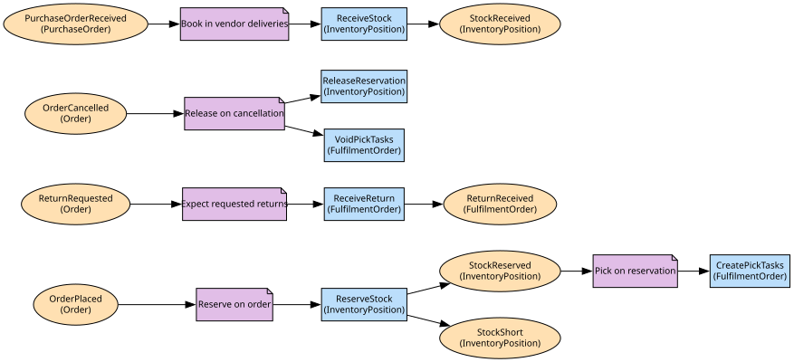

# Warehouse
Stock positions, reservations, picking and dispatch

**Owned by:** Fulfilment Team

## Serves
- [Fulfilment & Delivery / Warehousing](../../domains/fulfilment_&_delivery/subdomains/warehousing/index.md) (core)

## Glossary
| Term | Definition | Aliases | Embodied by |
| --- | --- | --- | --- |
| **On hand** | Physically present stock, whether or not reserved | Stock | InventoryPosition |
| **Package** | A box with one tracking label | Parcel | Package |

## Aggregates

### [InventoryPosition](aggregates/inventory_position/index.md)
How much of a SKU one site holds and how much is promised

### [FulfilmentOrder](aggregates/fulfilment_order/index.md)
The warehouse's view of an order: what to pick, how to pack, when it left

	
## Services
> No services.

## Schemas
| Name | Description | Attributes | Used by |
| --- | --- | --- | --- |
| StockReserved | - | **orderId**: `string`, siteId: `string` | StockReserved, StockShort, ReserveStock |
| ShipmentDispatched | The fact orders, payments and last mile all react to | **packageId**: `string`, orderId: `string`, label: `TrackingLabel` | ShipmentDispatched |
| ReturnReceived | - | **returnId**: `string`, condition: `'resellable' | 'damaged'` | ReturnReceived |

## Policies

| Name | Description | On | Then |
| --- | --- | --- | --- |
| Reserve on order | Every placed order gets stock held immediately | OrderPlaced | ReserveStock |
| Pick on reservation | Held stock becomes pick tasks | StockReserved | CreatePickTasks |
| Expect requested returns | A requested return is graded on arrival | ReturnRequested | ReceiveReturn |
| Book in vendor deliveries | The legacy export is translated into stock receipts | PurchaseOrderReceived | ReceiveStock |

## Context Relationships
| Upstream | Relationship | Downstream | Upstream Roles | Downstream Roles |
| --- | --- | --- | --- | --- |
| Order Management | upstream-downstream | Warehouse | published-language | anti-corruption-layer |
| Warehouse | upstream-downstream | Order Management | published-language | anti-corruption-layer |
| Warehouse | upstream-downstream | Payments | published-language | anti-corruption-layer |
| Warehouse | upstream-downstream | Last Mile | published-language | - |
| Vendor Purchasing (legacy) | upstream-downstream | Warehouse | published-language | anti-corruption-layer |
| Warehouse | shared-kernel | Last Mile | - | - |
| Fraud | upstream-downstream (implied) | Order Management | published-language | anti-corruption-layer |
| Order Management | upstream-downstream (implied) | Fraud | published-language | anti-corruption-layer |
| Seller Onboarding | upstream-downstream (implied) | Fraud | published-language | anti-corruption-layer |
| Fraud | upstream-downstream (implied) | Seller Onboarding | published-language | anti-corruption-layer |
| Payments | upstream-downstream (implied) | Order Management | open-host-service | anti-corruption-layer |
| Last Mile | upstream-downstream (implied) | Order Management | published-language | anti-corruption-layer |

## Consumptions
| Consumer | Consumed As | Provider | Consumable | Provided As |
| --- | --- | --- | --- | --- |
| [InventoryPosition](aggregates/inventory_position/index.md) | anti-corruption-layer | Order | OrderPlaced | published-language |
| [Order](../order_management/aggregates/order/index.md) | anti-corruption-layer | RiskAssessment | OrderRiskFlagged | published-language |
| [RiskAssessment](../fraud/aggregates/risk_assessment/index.md) | anti-corruption-layer | Order | OrderPlaced | published-language |
| [RiskAssessment](../fraud/aggregates/risk_assessment/index.md) | anti-corruption-layer | SellerAccount | SellerActivated | published-language |
| [SellerAccount](../seller_onboarding/aggregates/seller_account/index.md) | anti-corruption-layer | RiskAssessment | SellerRiskFlagged | published-language |
| [Order](../order_management/aggregates/order/index.md) | anti-corruption-layer | FulfilmentOrder | ShipmentDispatched | published-language |
| [Payment](../payments/aggregates/payment/index.md) | anti-corruption-layer | FulfilmentOrder | ShipmentDispatched | published-language |
| [DeliveryRoute](../last_mile/aggregates/delivery_route/index.md) | - | FulfilmentOrder | ShipmentDispatched | published-language |
| [Order](../order_management/aggregates/order/index.md) | anti-corruption-layer | FulfilmentOrder | ReturnReceived | published-language |
| [FulfilmentOrder](aggregates/fulfilment_order/index.md) | anti-corruption-layer | Order | ReturnRequested | published-language |
| [Order](../order_management/aggregates/order/index.md) | anti-corruption-layer | Payment | RefundPayment | open-host-service |
| [Order](../order_management/aggregates/order/index.md) | anti-corruption-layer | DeliveryRoute | ParcelDelivered | published-language |
| [InventoryPosition](aggregates/inventory_position/index.md) | anti-corruption-layer | PurchaseOrder | PurchaseOrderReceived | published-language |

