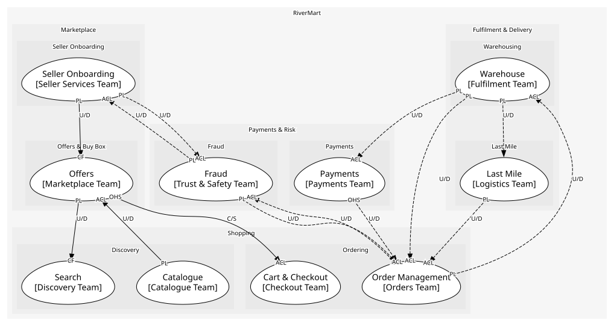

# Offers & Buy Box (core)
Which seller's offer wins the buy box. Core: this decision drives price, speed and seller trust

## Bounded Contexts

### [Offers](../../../../boundedcontexts/offers/index.md)
Sellers' offers on catalogue products and the buy box award

## Context Relationships
| Upstream | Relationship | Downstream | Upstream Roles | Downstream Roles |
| --- | --- | --- | --- | --- |
| Catalogue | upstream-downstream | Offers | published-language | anti-corruption-layer |
| Offers | upstream-downstream | Search | published-language | conformist |
| Seller Onboarding | upstream-downstream | Offers | published-language | conformist |
| Offers | customer-supplier | Cart & Checkout | open-host-service | anti-corruption-layer |
| Offers | upstream-downstream | Order Management | open-host-service | conformist |
| Fraud | upstream-downstream (implied) | Seller Onboarding | published-language | anti-corruption-layer |
| Order Management | upstream-downstream (implied) | Fraud | published-language | anti-corruption-layer |
| Fraud | upstream-downstream (implied) | Order Management | published-language | anti-corruption-layer |
| Warehouse | upstream-downstream (implied) | Order Management | published-language | anti-corruption-layer |
| Order Management | upstream-downstream (implied) | Warehouse | published-language | anti-corruption-layer |
| Vendor Purchasing (legacy) | upstream-downstream (implied) | Warehouse | published-language | anti-corruption-layer |
| Payments | upstream-downstream (implied) | Order Management | open-host-service | anti-corruption-layer |
| Order Management | upstream-downstream (implied) | Payments | published-language | anti-corruption-layer |
| Warehouse | upstream-downstream (implied) | Payments | published-language | anti-corruption-layer |
| Last Mile | upstream-downstream (implied) | Order Management | published-language | anti-corruption-layer |
| Warehouse | upstream-downstream (implied) | Last Mile | published-language | - |
| Seller Onboarding | upstream-downstream (implied) | Fraud | published-language | anti-corruption-layer |

## Consumptions
| Consumer | Consumed As | Provider | Consumable | Provided As |
| --- | --- | --- | --- | --- |
| [CheckoutOrchestrator](../../../../boundedcontexts/cart_&_checkout/services/checkout_orchestrator/index.md) | anti-corruption-layer | OfferAPI | GetOffer | open-host-service |
| [SearchIndex](../../../../boundedcontexts/search/aggregates/search_index/index.md) | conformist | Offer | BuyBoxAwarded | published-language |
| [Offer](../../../../boundedcontexts/offers/aggregates/offer/index.md) | anti-corruption-layer | Product | ProductListed | published-language |
| [Offer](../../../../boundedcontexts/offers/aggregates/offer/index.md) | anti-corruption-layer | Product | ProductRetired | published-language |
| [Offer](../../../../boundedcontexts/offers/aggregates/offer/index.md) | conformist | SellerAccount | SellerActivated | published-language |
| [SellerAccount](../../../../boundedcontexts/seller_onboarding/aggregates/seller_account/index.md) | anti-corruption-layer | RiskAssessment | SellerRiskFlagged | published-language |
| [RiskAssessment](../../../../boundedcontexts/fraud/aggregates/risk_assessment/index.md) | anti-corruption-layer | Order | OrderPlaced | published-language |
| [Order](../../../../boundedcontexts/order_management/aggregates/order/index.md) | anti-corruption-layer | RiskAssessment | OrderRiskFlagged | published-language |
| [Order](../../../../boundedcontexts/order_management/aggregates/order/index.md) | anti-corruption-layer | FulfilmentOrder | ShipmentDispatched | published-language |
| [FulfilmentOrder](../../../../boundedcontexts/warehouse/aggregates/fulfilment_order/index.md) | anti-corruption-layer | Order | ReturnRequested | published-language |
| [FulfilmentOrder](../../../../boundedcontexts/warehouse/aggregates/fulfilment_order/index.md) | anti-corruption-layer | Order | OrderCancelled | published-language |
| [Order](../../../../boundedcontexts/order_management/aggregates/order/index.md) | anti-corruption-layer | FulfilmentOrder | ReturnReceived | published-language |
| [Order](../../../../boundedcontexts/order_management/aggregates/order/index.md) | anti-corruption-layer | InventoryPosition | StockShort | published-language |
| [InventoryPosition](../../../../boundedcontexts/warehouse/aggregates/inventory_position/index.md) | anti-corruption-layer | Order | OrderPlaced | published-language |
| [InventoryPosition](../../../../boundedcontexts/warehouse/aggregates/inventory_position/index.md) | anti-corruption-layer | Order | OrderCancelled | published-language |
| [InventoryPosition](../../../../boundedcontexts/warehouse/aggregates/inventory_position/index.md) | anti-corruption-layer | PurchaseOrder | PurchaseOrderReceived | published-language |
| [Order](../../../../boundedcontexts/order_management/aggregates/order/index.md) | anti-corruption-layer | Payment | RefundPayment | open-host-service |
| [Payment](../../../../boundedcontexts/payments/aggregates/payment/index.md) | anti-corruption-layer | Order | OrderPlaced | published-language |
| [Payment](../../../../boundedcontexts/payments/aggregates/payment/index.md) | anti-corruption-layer | FulfilmentOrder | ShipmentDispatched | published-language |
| [Order](../../../../boundedcontexts/order_management/aggregates/order/index.md) | anti-corruption-layer | DeliveryRoute | ParcelDelivered | published-language |
| [DeliveryRoute](../../../../boundedcontexts/last_mile/aggregates/delivery_route/index.md) | - | FulfilmentOrder | ShipmentDispatched | published-language |
| [RiskAssessment](../../../../boundedcontexts/fraud/aggregates/risk_assessment/index.md) | anti-corruption-layer | SellerAccount | SellerActivated | published-language |
| [Offer](../../../../boundedcontexts/offers/aggregates/offer/index.md) | conformist | SellerAccount | SellerSuspended | published-language |
	
	
