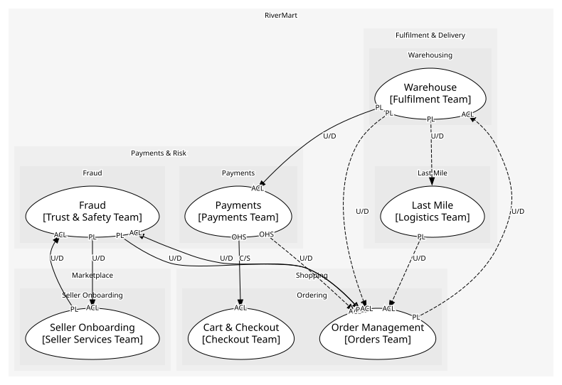

# Payments & Risk
Taking money safely

## Subdomains

### [Payments](subdomains/payments/index.md) (generic)
Authorise, capture, refund. Generic: a payment service provider does this for everyone

### [Fraud](subdomains/fraud/index.md) (supporting)
Scoring orders and sellers. Supporting: vendors exist, but marketplace signals are RiverMart's own

## Context Relationships
| Upstream | Relationship | Downstream | Upstream Roles | Downstream Roles |
| --- | --- | --- | --- | --- |
| Payments | customer-supplier | Cart & Checkout | open-host-service | anti-corruption-layer |
| Warehouse | upstream-downstream | Payments | published-language | anti-corruption-layer |
| Order Management | upstream-downstream | Fraud | published-language | anti-corruption-layer |
| Fraud | upstream-downstream | Order Management | published-language | anti-corruption-layer |
| Seller Onboarding | upstream-downstream | Fraud | published-language | anti-corruption-layer |
| Fraud | upstream-downstream | Seller Onboarding | published-language | anti-corruption-layer |
| Payments | upstream-downstream (implied) | Order Management | open-host-service | anti-corruption-layer |
| Order Management | upstream-downstream (implied) | Warehouse | published-language | anti-corruption-layer |
| Warehouse | upstream-downstream (implied) | Order Management | published-language | anti-corruption-layer |
| Last Mile | upstream-downstream (implied) | Order Management | published-language | anti-corruption-layer |
| Warehouse | upstream-downstream (implied) | Last Mile | published-language | - |

## Consumptions
| Consumer | Consumed As | Provider | Consumable | Provided As |
| --- | --- | --- | --- | --- |
| [CheckoutOrchestrator](../../boundedcontexts/cart_&_checkout/services/checkout_orchestrator/index.md) | anti-corruption-layer | Payment | AuthorisePayment | open-host-service |
| [Order](../../boundedcontexts/order_management/aggregates/order/index.md) | anti-corruption-layer | Payment | RefundPayment | open-host-service |
| [Payment](../../boundedcontexts/payments/aggregates/payment/index.md) | anti-corruption-layer | FulfilmentOrder | ShipmentDispatched | published-language |
| [FulfilmentOrder](../../boundedcontexts/warehouse/aggregates/fulfilment_order/index.md) | anti-corruption-layer | Order | ReturnRequested | published-language |
| [Order](../../boundedcontexts/order_management/aggregates/order/index.md) | anti-corruption-layer | RiskAssessment | OrderRiskFlagged | published-language |
| [SellerAccount](../../boundedcontexts/seller_onboarding/aggregates/seller_account/index.md) | anti-corruption-layer | RiskAssessment | SellerRiskFlagged | published-language |
| [RiskAssessment](../../boundedcontexts/fraud/aggregates/risk_assessment/index.md) | anti-corruption-layer | Order | OrderPlaced | published-language |
| [RiskAssessment](../../boundedcontexts/fraud/aggregates/risk_assessment/index.md) | anti-corruption-layer | SellerAccount | SellerActivated | published-language |
| [Order](../../boundedcontexts/order_management/aggregates/order/index.md) | anti-corruption-layer | FulfilmentOrder | ShipmentDispatched | published-language |
| [Order](../../boundedcontexts/order_management/aggregates/order/index.md) | anti-corruption-layer | FulfilmentOrder | ReturnReceived | published-language |
| [Order](../../boundedcontexts/order_management/aggregates/order/index.md) | anti-corruption-layer | DeliveryRoute | ParcelDelivered | published-language |
| [DeliveryRoute](../../boundedcontexts/last_mile/aggregates/delivery_route/index.md) | - | FulfilmentOrder | ShipmentDispatched | published-language |

	
