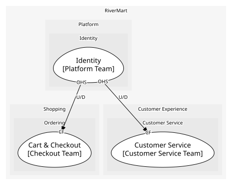

# Platform
Shared capabilities every domain leans on

## Subdomains

### [Identity](subdomains/identity/index.md) (generic)
Customer accounts and sign-in

## Context Relationships
| Upstream | Relationship | Downstream | Upstream Roles | Downstream Roles |
| --- | --- | --- | --- | --- |
| Identity | upstream-downstream | Cart & Checkout | open-host-service | conformist |
| Identity | upstream-downstream | Customer Service | open-host-service | conformist |

## Consumptions
| Consumer | Consumed As | Provider | Consumable | Provided As |
| --- | --- | --- | --- | --- |
| [CheckoutOrchestrator](../../boundedcontexts/cart_&_checkout/services/checkout_orchestrator/index.md) | conformist | IdentityAPI | GetCustomer | open-host-service |
| [Case](../../boundedcontexts/customer_service/aggregates/case/index.md) | conformist | IdentityAPI | GetCustomer | open-host-service |

	
