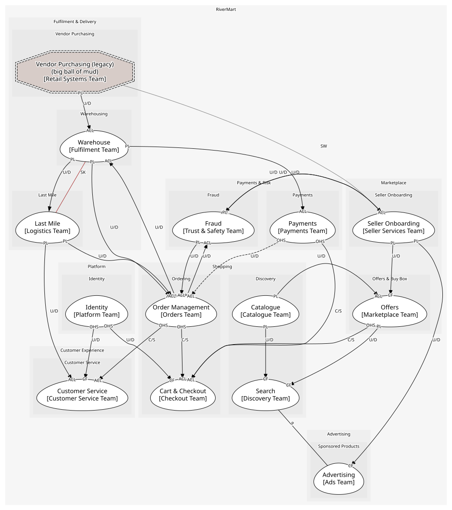

# RiverMart
A fictional online marketplace: catalogue, search, sellers and the buy box, cart and checkout, payments, warehousing, last mile, advertising, customer service and fraud.

[Glossary](./glossary.md)

## Domains

### [Shopping](../domains/shopping/index.md)
Everything a customer touches from search to placed order

### [Marketplace](../domains/marketplace/index.md)
Third-party sellers and their offers

### [Fulfilment & Delivery](../domains/fulfilment_&_delivery/index.md)
Getting stock into warehouses and parcels to doors

### [Payments & Risk](../domains/payments_&_risk/index.md)
Taking money safely

### [Advertising](../domains/advertising/index.md)
Sponsored placements sold to sellers

### [Customer Experience](../domains/customer_experience/index.md)
Help after the order

### [Platform](../domains/platform/index.md)
Shared capabilities every domain leans on

## Diagnostics
| Severity | Rule | Message | Element |
| --- | --- | --- | --- |
| error | aggregate-root | Aggregate "Wishlist" has 2 root entities; an aggregate has exactly one | `boundedcontexts/cart_&_checkout/aggregates/wishlist` |
| error | cross-aggregate-reference | "Case" includes "OrderLine" in another aggregate; across aggregates only "references" is allowed | `boundedcontexts/customer_service/aggregates/case/entities/case` |
| warning | role-coherence | "DeliveryRoute" consumes "ShipmentDispatched" from another context without a downstream role (conformist or anti-corruption-layer) | `boundedcontexts/last_mile/aggregates/delivery_route` |

## Teams
| Team | Owns |
| --- | --- |
| Catalogue Team | Catalogue |
| Discovery Team | Search |
| Marketplace Team | Offers |
| Seller Services Team | Seller Onboarding |
| Checkout Team | Cart & Checkout |
| Orders Team | Order Management |
| Payments Team | Payments |
| Trust & Safety Team | Fraud |
| Fulfilment Team | Warehouse |
| Logistics Team | Last Mile |
| Ads Team | Advertising |
| Customer Service Team | Customer Service |
| Retail Systems Team | Vendor Purchasing (legacy) |
| Platform Team | Identity |

## Context Relationships
| Upstream | Relationship | Downstream | Upstream Roles | Downstream Roles |
| --- | --- | --- | --- | --- |
| Catalogue | upstream-downstream | Offers | published-language | anti-corruption-layer |
| Catalogue | upstream-downstream | Search | published-language | conformist |
| Offers | upstream-downstream | Search | published-language | conformist |
| Seller Onboarding | upstream-downstream | Offers | published-language | conformist |
| Offers | customer-supplier | Cart & Checkout | open-host-service | anti-corruption-layer |
| Payments | customer-supplier | Cart & Checkout | open-host-service | anti-corruption-layer |
| Order Management | customer-supplier | Cart & Checkout | open-host-service | anti-corruption-layer |
| Identity | upstream-downstream | Cart & Checkout | open-host-service | conformist |
| Offers | upstream-downstream | Order Management | open-host-service | conformist |
| Payments | upstream-downstream | Order Management | open-host-service | anti-corruption-layer |
| Order Management | upstream-downstream | Payments | published-language | anti-corruption-layer |
| Catalogue | upstream-downstream | Advertising | open-host-service | conformist |
| Order Management | upstream-downstream | Warehouse | published-language | anti-corruption-layer |
| Warehouse | upstream-downstream | Order Management | published-language | anti-corruption-layer |
| Warehouse | upstream-downstream | Payments | published-language | anti-corruption-layer |
| Order Management | upstream-downstream | Fraud | published-language | anti-corruption-layer |
| Fraud | upstream-downstream | Order Management | published-language | anti-corruption-layer |
| Seller Onboarding | upstream-downstream | Fraud | published-language | anti-corruption-layer |
| Fraud | upstream-downstream | Seller Onboarding | published-language | anti-corruption-layer |
| Warehouse | upstream-downstream | Last Mile | published-language | - |
| Last Mile | upstream-downstream | Order Management | published-language | anti-corruption-layer |
| Last Mile | upstream-downstream | Customer Service | published-language | anti-corruption-layer |
| Order Management | customer-supplier | Customer Service | open-host-service | anti-corruption-layer |
| Identity | upstream-downstream | Customer Service | open-host-service | conformist |
| Seller Onboarding | upstream-downstream | Advertising | published-language | conformist |
| Vendor Purchasing (legacy) | upstream-downstream | Warehouse | published-language | anti-corruption-layer |
| Warehouse | shared-kernel | Last Mile | - | - |
| Search | partnership | Advertising | - | - |
| Vendor Purchasing (legacy) | separate-ways | Seller Onboarding | - | - |

## Consumptions
| Consumer | Consumed As | Provider | Consumable | Provided As |
| --- | --- | --- | --- | --- |
| [AdsAPI](../boundedcontexts/advertising/services/ads_api/index.md) | conformist | CatalogueAPI | GetProduct | open-host-service |
| [SearchIndex](../boundedcontexts/search/aggregates/search_index/index.md) | conformist | Product | ProductListed | published-language |
| [Offer](../boundedcontexts/offers/aggregates/offer/index.md) | anti-corruption-layer | Product | ProductListed | published-language |
| [SearchIndex](../boundedcontexts/search/aggregates/search_index/index.md) | conformist | Product | ProductRetired | published-language |
| [Offer](../boundedcontexts/offers/aggregates/offer/index.md) | anti-corruption-layer | Product | ProductRetired | published-language |
| [SearchAPI](../boundedcontexts/search/services/search_api/index.md) | conformist | AdsAPI | GetSponsoredResults | open-host-service |
| [SearchAPI](../boundedcontexts/search/services/search_api/index.md) | conformist | AdsAPI | RecordAdClick | open-host-service |
| [SearchIndex](../boundedcontexts/search/aggregates/search_index/index.md) | conformist | Offer | BuyBoxAwarded | published-language |
| [Offer](../boundedcontexts/offers/aggregates/offer/index.md) | conformist | SellerAccount | SellerActivated | published-language |
| [RiskAssessment](../boundedcontexts/fraud/aggregates/risk_assessment/index.md) | anti-corruption-layer | SellerAccount | SellerActivated | published-language |
| [Offer](../boundedcontexts/offers/aggregates/offer/index.md) | conformist | SellerAccount | SellerSuspended | published-language |
| [Campaign](../boundedcontexts/advertising/aggregates/campaign/index.md) | conformist | SellerAccount | SellerSuspended | published-language |
| [SellerAccount](../boundedcontexts/seller_onboarding/aggregates/seller_account/index.md) | anti-corruption-layer | RiskAssessment | SellerRiskFlagged | published-language |
| [Order](../boundedcontexts/order_management/aggregates/order/index.md) | anti-corruption-layer | RiskAssessment | OrderRiskFlagged | published-language |
| [RiskAssessment](../boundedcontexts/fraud/aggregates/risk_assessment/index.md) | anti-corruption-layer | Order | OrderPlaced | published-language |
| [Payment](../boundedcontexts/payments/aggregates/payment/index.md) | anti-corruption-layer | Order | OrderPlaced | published-language |
| [InventoryPosition](../boundedcontexts/warehouse/aggregates/inventory_position/index.md) | anti-corruption-layer | Order | OrderPlaced | published-language |
| [InventoryPosition](../boundedcontexts/warehouse/aggregates/inventory_position/index.md) | anti-corruption-layer | Order | OrderCancelled | published-language |
| [FulfilmentOrder](../boundedcontexts/warehouse/aggregates/fulfilment_order/index.md) | anti-corruption-layer | Order | OrderCancelled | published-language |
| [FulfilmentOrder](../boundedcontexts/warehouse/aggregates/fulfilment_order/index.md) | anti-corruption-layer | Order | ReturnRequested | published-language |
| [CheckoutOrchestrator](../boundedcontexts/cart_&_checkout/services/checkout_orchestrator/index.md) | anti-corruption-layer | Order | PlaceOrder | open-host-service |
| [Case](../boundedcontexts/customer_service/aggregates/case/index.md) | anti-corruption-layer | Order | RequestReturn | open-host-service |
| [Order](../boundedcontexts/order_management/aggregates/order/index.md) | anti-corruption-layer | FulfilmentOrder | ShipmentDispatched | published-language |
| [Payment](../boundedcontexts/payments/aggregates/payment/index.md) | anti-corruption-layer | FulfilmentOrder | ShipmentDispatched | published-language |
| [DeliveryRoute](../boundedcontexts/last_mile/aggregates/delivery_route/index.md) | - | FulfilmentOrder | ShipmentDispatched | published-language |
| [Order](../boundedcontexts/order_management/aggregates/order/index.md) | anti-corruption-layer | FulfilmentOrder | ReturnReceived | published-language |
| [Order](../boundedcontexts/order_management/aggregates/order/index.md) | anti-corruption-layer | InventoryPosition | StockShort | published-language |
| [InventoryPosition](../boundedcontexts/warehouse/aggregates/inventory_position/index.md) | anti-corruption-layer | PurchaseOrder | PurchaseOrderReceived | published-language |
| [Order](../boundedcontexts/order_management/aggregates/order/index.md) | anti-corruption-layer | Payment | RefundPayment | open-host-service |
| [CheckoutOrchestrator](../boundedcontexts/cart_&_checkout/services/checkout_orchestrator/index.md) | anti-corruption-layer | Payment | PaymentDeclined | published-language |
| [CheckoutOrchestrator](../boundedcontexts/cart_&_checkout/services/checkout_orchestrator/index.md) | anti-corruption-layer | Payment | AuthorisePayment | open-host-service |
| [Order](../boundedcontexts/order_management/aggregates/order/index.md) | anti-corruption-layer | DeliveryRoute | ParcelDelivered | published-language |
| [Case](../boundedcontexts/customer_service/aggregates/case/index.md) | anti-corruption-layer | DeliveryRoute | DeliveryAttemptFailed | published-language |
| [CheckoutOrchestrator](../boundedcontexts/cart_&_checkout/services/checkout_orchestrator/index.md) | anti-corruption-layer | OfferAPI | GetOffer | open-host-service |
| [CheckoutOrchestrator](../boundedcontexts/cart_&_checkout/services/checkout_orchestrator/index.md) | conformist | IdentityAPI | GetCustomer | open-host-service |
| [Case](../boundedcontexts/customer_service/aggregates/case/index.md) | conformist | IdentityAPI | GetCustomer | open-host-service |
| [Case](../boundedcontexts/customer_service/aggregates/case/index.md) | anti-corruption-layer | OrderAPI | GetOrder | open-host-service |
	

