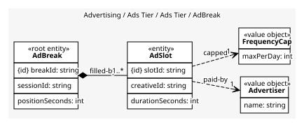
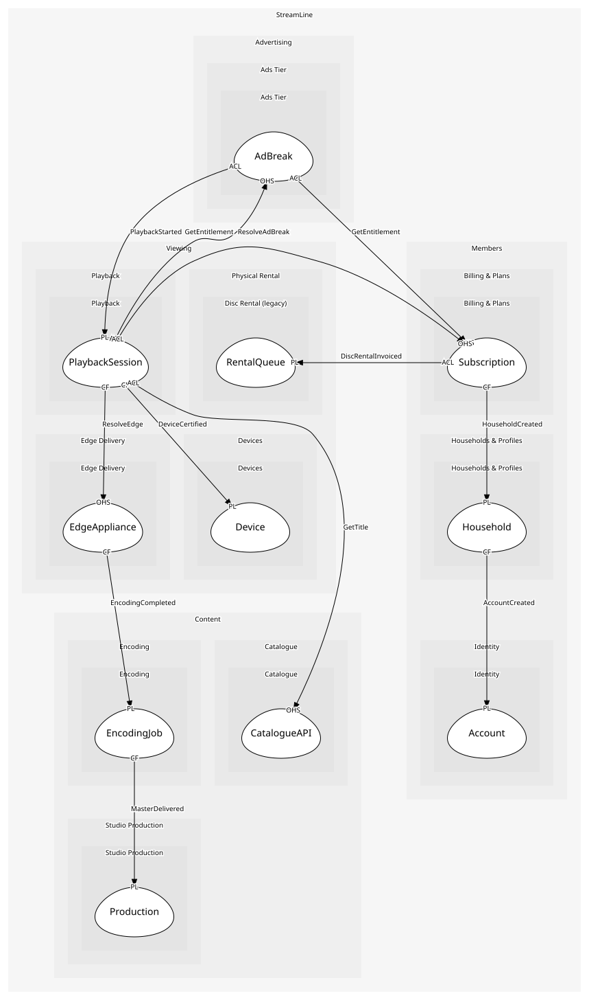

# AdBreak
A pod of slots at a position in a session

## Entities and Value Objects
| Type | Name | Description | Attributes |
| --- | --- | --- | --- |
| Entity (Root) | **AdBreak** | One break in one session | **breakId**: `string`, sessionId: `string`, positionSeconds: `int` |
| Entity | AdSlot | One creative in the break | **slotId**: `string`, creativeId: `string`, durationSeconds: `int` |
| Value Object | Advertiser | Who paid for the creative | name: `string` |
| Value Object | FrequencyCap | How often one creative may be shown to a household | maxPerDay: `int` |

## Relationships
| Source | Description | Target | Relation | Cardinality |
| --- | --- | --- | --- | --- |
| [AdBreak](entities/ad_break/index.md) | filled-by | AdBreak - AdSlot | includes | 1..* |
| [AdSlot](entities/ad_slot/index.md) | paid-by | AdBreak - Advertiser | uses | 1 |
| [AdSlot](entities/ad_slot/index.md) | capped | AdBreak - FrequencyCap | uses | 1 |

## Invariants
| Name | Description | Constrains |
| --- | --- | --- |
| BreakDurationCap | A break is at most ninety seconds | AdBreak, AdSlot |
| NoRepeatCreativeWithinBreak | A creative appears at most once per break | AdSlot |
| AdsOnlyOnAdSupportedPlan | Breaks exist only for sessions on the ad-supported plan | AdBreak |

## Provides
| Name | Type | Internal | Pattern | Description | Schema | Raises |
| --- | --- | --- | --- | --- | --- | --- |
| AdImpressionRecorded | event | no | published-language | A creative was shown | [AdImpressionRecorded](../../index.md#schemas) | - |
| ResolveAdBreak | operation | no | open-host-service | The slots for a break the player has reached | [ResolveAdBreak](../../index.md#schemas) | - |
| PrepareBreaks | operation | yes | - | Plan the breaks for a session by plan and country | - | - |
| RecordImpression | operation | yes | - | The player confirmed a creative played | - | AdImpressionRecorded |

## Consumes

### PlaybackStarted [anti-corruption-layer]
A session began; the ads tier prepares breaks
- **Provider**: [PlaybackSession](../../../playback/aggregates/playback_session/index.md)

	
