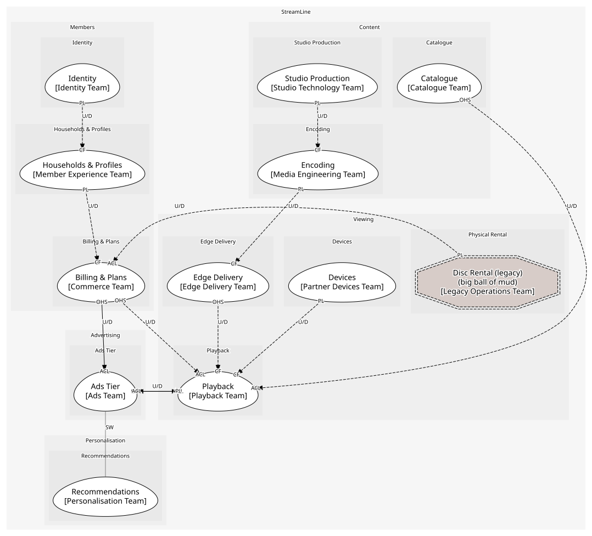
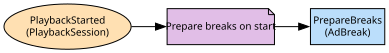

# Ads Tier
Breaks, slots and impressions for the ad-supported plan

**Owned by:** Ads Team

## Serves
- [Advertising / Ads Tier](../../domains/advertising/subdomains/ads_tier/index.md) (supporting)

## Glossary
| Term | Definition | Aliases | Embodied by |
| --- | --- | --- | --- |
| **Pod** | A break's worth of slots. The player says break | Break | AdBreak |
| **Impression** | One creative shown once | - | AdImpressionRecorded |

## Aggregates

### [AdBreak](aggregates/ad_break/index.md)
A pod of slots at a position in a session

	
## Services
> No services.

## Schemas
| Name | Description | Attributes | Used by |
| --- | --- | --- | --- |
| ResolveAdBreak | - | sessionId: `string`, positionSeconds: `int` | ResolveAdBreak |
| AdImpressionRecorded | What advertiser billing consumes; out of scope here | **slotId**: `string`, creativeId: `string`, at: `date-time` | AdImpressionRecorded |

## Policies

| Name | Description | On | Then |
| --- | --- | --- | --- |
| Prepare breaks on start | Breaks are planned when the session starts, before the first one is reached | PlaybackStarted | PrepareBreaks |

## Context Relationships
| Upstream | Relationship | Downstream | Upstream Roles | Downstream Roles |
| --- | --- | --- | --- | --- |
| Playback | upstream-downstream | Ads Tier | published-language | anti-corruption-layer |
| Ads Tier | upstream-downstream | Playback | open-host-service | anti-corruption-layer |
| Billing & Plans | upstream-downstream | Ads Tier | open-host-service | anti-corruption-layer |
| Ads Tier | separate-ways | Recommendations | - | - |
| Catalogue | upstream-downstream (implied) | Playback | open-host-service | anti-corruption-layer |
| Edge Delivery | upstream-downstream (implied) | Playback | open-host-service | conformist |
| Encoding | upstream-downstream (implied) | Edge Delivery | published-language | conformist |
| Studio Production | upstream-downstream (implied) | Encoding | published-language | conformist |
| Devices | upstream-downstream (implied) | Playback | published-language | conformist |
| Billing & Plans | upstream-downstream (implied) | Playback | open-host-service | anti-corruption-layer |
| Households & Profiles | upstream-downstream (implied) | Billing & Plans | published-language | conformist |
| Identity | upstream-downstream (implied) | Households & Profiles | published-language | conformist |
| Disc Rental (legacy) | upstream-downstream (implied) | Billing & Plans | published-language | anti-corruption-layer |

## Consumptions
| Consumer | Consumed As | Provider | Consumable | Provided As |
| --- | --- | --- | --- | --- |
| [PlaybackSession](../playback/aggregates/playback_session/index.md) | anti-corruption-layer | AdBreak | ResolveAdBreak | open-host-service |
| [AdBreak](aggregates/ad_break/index.md) | anti-corruption-layer | PlaybackSession | PlaybackStarted | published-language |
| [PlaybackSession](../playback/aggregates/playback_session/index.md) | anti-corruption-layer | CatalogueAPI | GetTitle | open-host-service |
| [PlaybackSession](../playback/aggregates/playback_session/index.md) | conformist | EdgeAppliance | ResolveEdge | open-host-service |
| [EdgeAppliance](../edge_delivery/aggregates/edge_appliance/index.md) | conformist | EncodingJob | EncodingCompleted | published-language |
| [EncodingJob](../encoding/aggregates/encoding_job/index.md) | conformist | Production | MasterDelivered | published-language |
| [PlaybackSession](../playback/aggregates/playback_session/index.md) | conformist | Device | DeviceCertified | published-language |
| [PlaybackSession](../playback/aggregates/playback_session/index.md) | anti-corruption-layer | Subscription | GetEntitlement | open-host-service |
| [Subscription](../billing_&_plans/aggregates/subscription/index.md) | conformist | Household | HouseholdCreated | published-language |
| [Household](../households_&_profiles/aggregates/household/index.md) | conformist | Account | AccountCreated | published-language |
| [Subscription](../billing_&_plans/aggregates/subscription/index.md) | anti-corruption-layer | RentalQueue | DiscRentalInvoiced | published-language |
| [AdBreak](aggregates/ad_break/index.md) | anti-corruption-layer | Subscription | GetEntitlement | open-host-service |

