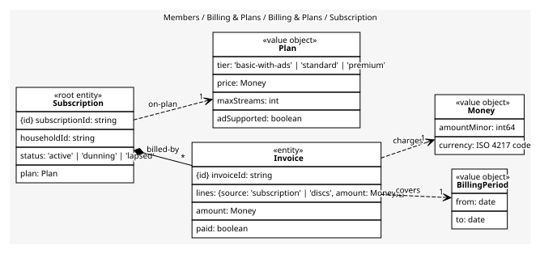
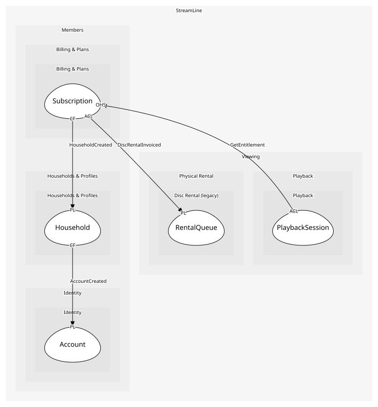

# Subscription
A household on a plan, and its invoices

## Entities and Value Objects
| Type | Name | Description | Attributes |
| --- | --- | --- | --- |
| Entity (Root) | **Subscription** | The household's current arrangement | **subscriptionId**: `string`, householdId: `string`, status: `'active' | 'dunning' | 'lapsed'`, plan: `Plan` |
| Entity | Invoice | One period's charge; an entity because it is numbered and paid | **invoiceId**: `string`, amount: `Money`, paid: `boolean` |
| Value Object | Plan | A tier: price, concurrent streams, ad-supported or not | tier: `'basic-with-ads' | 'standard' | 'premium'`, price: `Money`, maxStreams: `int`, adSupported: `boolean` |
| Value Object | Money | An amount in a currency: minor units and an ISO 4217 code | amountMinor: `int64`, currency: `ISO 4217 code` |
| Value Object | BillingPeriod | The month an invoice covers | from: `date`, to: `date` |

## Relationships
| Source | Description | Target | Relation | Cardinality |
| --- | --- | --- | --- | --- |
| [Subscription](entities/subscription/index.md) | billed-by | Subscription - Invoice | includes | * |
| [Invoice](entities/invoice/index.md) | covers | Subscription - BillingPeriod | uses | 1 |
| [Invoice](entities/invoice/index.md) | charges | Subscription - Money | uses | 1 |
| [Subscription](entities/subscription/index.md) | on-plan | Subscription - Plan | uses | 1 |

## Invariants
| Name | Description | Constrains |
| --- | --- | --- |
| OneActiveSubscriptionPerHousehold | A household has at most one active subscription | Subscription |
| InvoiceAmountEqualsPlanPrice | An invoice charges exactly the plan price for its period | Invoice, Plan |
| NoEntitlementWhenLapsed | A lapsed subscription entitles nothing | Subscription |

## Provides
| Name | Type | Internal | Pattern | Description | Schema | Raises |
| --- | --- | --- | --- | --- | --- | --- |
| SubscriptionActivated | event | no | published-language | A household is paying | [SubscriptionRef](../../index.md#schemas) | - |
| SubscriptionLapsed | event | no | published-language | Dunning failed; entitlement ends | [SubscriptionRef](../../index.md#schemas) | - |
| PaymentFailed | event | yes | - | A renewal charge bounced | - | - |
| StartSubscription | operation | no | open-host-service | Put a household on a plan | [SubscriptionRef](../../index.md#schemas) | SubscriptionActivated |
| GetEntitlement | operation | no | open-host-service | Whether a household may stream, and how many at once | [EntitlementRequest](../../index.md#schemas) | - |
| ChargeRenewal | operation | yes | - | Invoice and charge the next period | - | PaymentFailed |
| StartDunning | operation | yes | - | Retry the charge over a grace period | - | - |
| LapseSubscription | operation | yes | - | End entitlement after dunning fails | - | SubscriptionLapsed |
| AddInvoiceLine | operation | yes | - | Add a charge from another line of business to the household's bill | - | - |

## Consumes

### HouseholdCreated [conformist]
A new paying unit exists, without a plan yet
- **Provider**: [Household](../../../households_&_profiles/aggregates/household/index.md)

### DiscRentalInvoiced [anti-corruption-layer]
The monthly disc charge for a member
- **Provider**: [RentalQueue](../../../disc_rental_(legacy)/aggregates/rental_queue/index.md)

	
