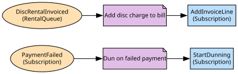

# Billing & Plans
Subscriptions, invoices and entitlement

**Owned by:** Commerce Team

## Serves
- [Members / Billing & Plans](../../domains/members/subdomains/billing_&_plans/index.md) (generic)

## Glossary
| Term | Definition | Aliases | Embodied by |
| --- | --- | --- | --- |
| **Plan** | A tier with a price, a stream limit and whether it carries ads | - | Plan |
| **Entitlement** | The right to stream, derived from an active subscription | - | GetEntitlement |

## Aggregates

### [Subscription](aggregates/subscription/index.md)
A household on a plan, and its invoices

	
## Services
> No services.

## Schemas
| Name | Description | Attributes | Used by |
| --- | --- | --- | --- |
| SubscriptionRef | - | **subscriptionId**: `string`, householdId: `string` | SubscriptionActivated, SubscriptionLapsed, StartSubscription |
| EntitlementRequest | What Playback asks: which household, for how many streams | householdId: `string` | GetEntitlement |

## Policies

| Name | Description | On | Then |
| --- | --- | --- | --- |
| Await plan on household | A new household is registered in billing until it picks a plan | HouseholdCreated | RegisterHousehold |
| Dun on failed payment | A failed renewal starts the grace period, not an immediate lapse | PaymentFailed | StartDunning |
| Add disc charge to bill | The legacy export is translated into an invoice line on the household | DiscRentalInvoiced | AddInvoiceLine |

## Context Relationships
| Upstream | Relationship | Downstream | Upstream Roles | Downstream Roles |
| --- | --- | --- | --- | --- |
| Billing & Plans | customer-supplier | Playback | open-host-service | anti-corruption-layer |
| Billing & Plans | upstream-downstream | Ads Tier | open-host-service | anti-corruption-layer |
| Households & Profiles | upstream-downstream | Billing & Plans | published-language | conformist |
| Disc Rental (legacy) | upstream-downstream | Billing & Plans | published-language | anti-corruption-layer |
| Identity | upstream-downstream (implied) | Households & Profiles | published-language | conformist |

## Consumptions
| Consumer | Consumed As | Provider | Consumable | Provided As |
| --- | --- | --- | --- | --- |
| [PlaybackSession](../playback/aggregates/playback_session/index.md) | anti-corruption-layer | Subscription | GetEntitlement | open-host-service |
| [AdBreak](../ads_tier/aggregates/ad_break/index.md) | anti-corruption-layer | Subscription | GetEntitlement | open-host-service |
| [Subscription](aggregates/subscription/index.md) | conformist | Household | HouseholdCreated | published-language |
| [Household](../households_&_profiles/aggregates/household/index.md) | conformist | Account | AccountCreated | published-language |
| [Subscription](aggregates/subscription/index.md) | anti-corruption-layer | RentalQueue | DiscRentalInvoiced | published-language |

