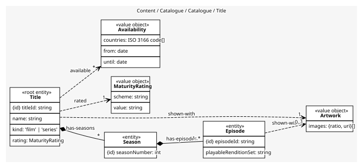
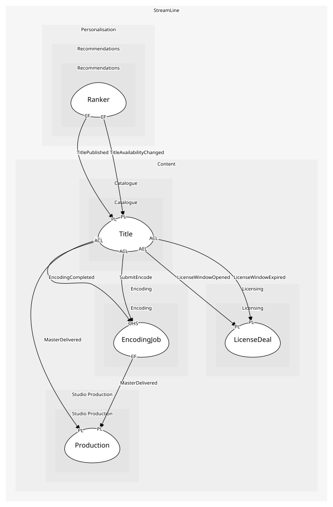

# Title
A film or series as members see it, with seasons, episodes, artwork, rating and availability

## Entities and Value Objects
| Type | Name | Description | Attributes |
| --- | --- | --- | --- |
| Entity (Root) | **Title** | One film or series | **titleId**: `string`, name: `string`, kind: `'film' | 'series'`, rating: `MaturityRating`, productionId: `string`, playableRenditionSet: `string` |
| Entity | Episode | What a member plays; carries artwork and a rating, unlike the studio's episode | **episodeId**: `string`, masterEpisodeNumber: `int`, playableRenditionSet: `string`, rating: `MaturityRating` |
| Entity | Season | A numbered group of episodes | **seasonNumber**: `int` |
| Value Object | Artwork | Images by aspect ratio | images: `{ratio, uri}[]` |
| Value Object | MaturityRating | The rating shown and enforced by profile maturity settings | scheme: `string`, value: `string` |
| Value Object | Availability | Countries and dates a title is live, derived from licence windows or studio ownership | countries: `ISO 3166 code[]`, from: `date`, until: `date` |

## Relationships
| Source | Description | Target | Relation | Cardinality |
| --- | --- | --- | --- | --- |
| [Title](entities/title/index.md) | has-seasons | Title - Season | includes | * |
| [Season](entities/season/index.md) | has-episodes | Title - Episode | includes | 1..* |
| [Episode](entities/episode/index.md) | shown-with | Title - Artwork | uses | 0..1 |
| [Episode](entities/episode/index.md) | rated | Title - MaturityRating | uses | 0..1 |
| [Title](entities/title/index.md) | shown-with | Title - Artwork | uses | 1 |
| [Title](entities/title/index.md) | rated | Title - MaturityRating | uses | 1 |
| [Title](entities/title/index.md) | available | Title - Availability | uses | * |

## Invariants
| Name | Description | Constrains |
| --- | --- | --- |
| PublishedTitleHasPlayableAsset | A title is published only when it (a film) or at least one of its episodes (a series) has a completed encode | Title, Episode |
| RatingRequiredBeforePublish | No rating, no publish; profiles enforce maturity on it | MaturityRating |
| AvailabilityMatchesLicence | Availability in a country never exceeds a licence window or studio ownership | Availability |

## Provides
| Name | Type | Internal | Pattern | Description | Schema | Raises |
| --- | --- | --- | --- | --- | --- | --- |
| TitlePublished | event | no | published-language | Members can now see the title somewhere | [TitleRef](../../index.md#schemas) | - |
| TitleAvailabilityChanged | event | no | published-language | Where and when a title is live changed | [TitleAvailabilityChanged](../../index.md#schemas) | - |
| TitleUnpublished | event | yes | - | The title came down everywhere | - | - |
| PublishTitle | operation | yes | - | Make a title visible once it has an encode and a rating | - | TitlePublished |
| UpdateAvailability | operation | yes | - | Recompute availability from windows | - | TitleAvailabilityChanged |
| UnpublishTitle | operation | yes | - | Take a title down the day its last window expires | - | TitleUnpublished |

## Consumes

### MasterDelivered [anti-corruption-layer]
A finished master is in the delivery bucket
- **Provider**: [Production](../../../studio_production/aggregates/production/index.md)

### EncodingCompleted [anti-corruption-layer]
All renditions are available
- **Provider**: [EncodingJob](../../../encoding/aggregates/encoding_job/index.md)

### LicenseWindowOpened [anti-corruption-layer]
A title may be shown in these countries from today
- **Provider**: [LicenseDeal](../../../licensing/aggregates/license_deal/index.md)

### LicenseWindowExpired [anti-corruption-layer]
The title must come down in these countries today
- **Provider**: [LicenseDeal](../../../licensing/aggregates/license_deal/index.md)

### SubmitEncode [anti-corruption-layer]
Queue a master for encoding
- **Provider**: [EncodingJob](../../../encoding/aggregates/encoding_job/index.md)

	
