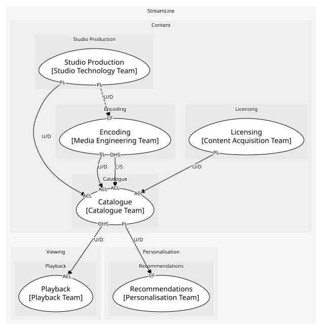
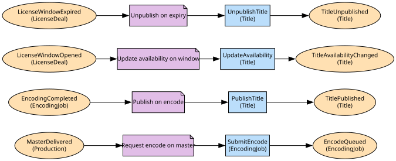

# Catalogue
What members can see, where and when

**Owned by:** Catalogue Team

## Serves
- [Content / Catalogue](../../domains/content/subdomains/catalogue/index.md) (supporting)

## Glossary
| Term | Definition | Aliases | Embodied by |
| --- | --- | --- | --- |
| **Title** | A film or series as a member sees it | - | Title |
| **Episode** | What a member plays, with artwork and a rating. The studio's episode is the production artefact behind it | - | Episode |
| **Availability** | The countries and dates a title is live | - | Availability |

## Aggregates

### [Title](aggregates/title/index.md)
A film or series as members see it, with seasons, episodes, artwork, rating and availability

	
## Services

### [CatalogueAPI](services/catalogue_api/index.md)
The documented read API for titles

## Schemas
| Name | Description | Attributes | Used by |
| --- | --- | --- | --- |
| TitleRef | Identifies one title, optionally one episode | **titleId**: `string`, episodeId: `string` | TitlePublished, GetTitle, PlaybackStarted |
| TitleAvailabilityChanged | - | **titleId**: `string`, availability: `Availability` | TitleAvailabilityChanged |

## Policies

| Name | Description | On | Then |
| --- | --- | --- | --- |
| Request encode on master | A delivered master is queued for encoding | MasterDelivered | SubmitEncode |
| Publish on encode | A completed encode makes the title publishable | EncodingCompleted | PublishTitle |
| Update availability on window | An opened window changes where the title is live | LicenseWindowOpened | UpdateAvailability |
| Unpublish on expiry | An expired window takes the title down that day | LicenseWindowExpired | UnpublishTitle |

## Context Relationships
| Upstream | Relationship | Downstream | Upstream Roles | Downstream Roles |
| --- | --- | --- | --- | --- |
| Studio Production | upstream-downstream | Catalogue | published-language | anti-corruption-layer |
| Licensing | upstream-downstream | Catalogue | published-language | anti-corruption-layer |
| Encoding | upstream-downstream | Catalogue | published-language | anti-corruption-layer |
| Encoding | customer-supplier | Catalogue | open-host-service | anti-corruption-layer |
| Catalogue | upstream-downstream | Playback | open-host-service | anti-corruption-layer |
| Catalogue | upstream-downstream | Recommendations | published-language | conformist |
| Studio Production | upstream-downstream (implied) | Encoding | published-language | conformist |

## Consumptions
| Consumer | Consumed As | Provider | Consumable | Provided As |
| --- | --- | --- | --- | --- |
| [PlaybackSession](../playback/aggregates/playback_session/index.md) | anti-corruption-layer | CatalogueAPI | GetTitle | open-host-service |
| [TasteProfile](../recommendations/aggregates/taste_profile/index.md) | conformist | Title | TitlePublished | published-language |
| [Title](aggregates/title/index.md) | anti-corruption-layer | Production | MasterDelivered | published-language |
| [Title](aggregates/title/index.md) | anti-corruption-layer | EncodingJob | EncodingCompleted | published-language |
| [EncodingJob](../encoding/aggregates/encoding_job/index.md) | conformist | Production | MasterDelivered | published-language |
| [Title](aggregates/title/index.md) | anti-corruption-layer | LicenseDeal | LicenseWindowOpened | published-language |
| [Title](aggregates/title/index.md) | anti-corruption-layer | LicenseDeal | LicenseWindowExpired | published-language |
| [Title](aggregates/title/index.md) | anti-corruption-layer | EncodingJob | SubmitEncode | open-host-service |

