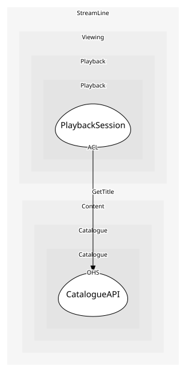

# CatalogueAPI
The documented read API for titles

## Provides
| Name | Type | Internal | Pattern | Description | Schema | Raises |
| --- | --- | --- | --- | --- | --- | --- |
| GetTitle | operation | no | open-host-service | Read a title with seasons, episodes and availability | [TitleRef](../../index.md#schemas) | - |

## Consumes
> No consumptions.
	
