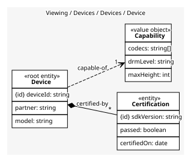
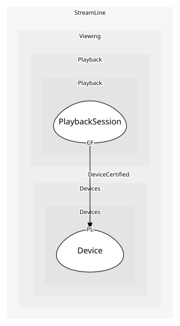

# Device
A partner device model and its certifications

## Entities and Value Objects
| Type | Name | Description | Attributes |
| --- | --- | --- | --- |
| Entity (Root) | **Device** | One model from one partner | **deviceId**: `string`, partner: `string`, model: `string` |
| Entity | Certification | A pass or fail against one SDK version | **sdkVersion**: `string`, passed: `boolean`, certifiedOn: `date` |
| Value Object | Capability | Codecs, DRM level and maximum resolution | codecs: `string[]`, drmLevel: `string`, maxHeight: `int` |

## Relationships
| Source | Description | Target | Relation | Cardinality |
| --- | --- | --- | --- | --- |
| [Device](entities/device/index.md) | certified-by | Device - Certification | includes | * |
| [Device](entities/device/index.md) | capable-of | Device - Capability | uses | 1 |

## Invariants
| Name | Description | Constrains |
| --- | --- | --- |
| CertifiedBeforePlayback | A device plays only with a passed certification against the current SDK | Certification |
| CapabilitiesDeclared | A device is registered with its capabilities or not at all | Capability |

## Provides
| Name | Type | Internal | Pattern | Description | Schema | Raises |
| --- | --- | --- | --- | --- | --- | --- |
| DeviceRegistered | event | yes | - | A partner submitted a model | - | - |
| DeviceCertified | event | no | published-language | A model passed against an SDK version; Playback may use it | [DeviceCertified](../../index.md#schemas) | - |
| RegisterDevice | operation | no | open-host-service | Submit a model with its capabilities | - | DeviceRegistered |
| Certify | operation | yes | - | Run the certification suite against an SDK | - | DeviceCertified |

## Consumes
> No consumptions.
	
