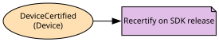

# Devices
Partner device models and their certification

**Owned by:** Partner Devices Team

## Serves
- [Viewing / Devices](../../domains/viewing/subdomains/devices/index.md) (supporting)

## Glossary
| Term | Definition | Aliases | Embodied by |
| --- | --- | --- | --- |
| **Device** | A partner device model, not an individual unit | - | Device |

## Aggregates

### [Device](aggregates/device/index.md)
A partner device model and its certifications

	
## Services
> No services.

## Schemas
| Name | Description | Attributes | Used by |
| --- | --- | --- | --- |
| DeviceCertified | - | **deviceId**: `string`, sdkVersion: `string`, capability: `Capability` | DeviceCertified |

## Policies

| Name | Description | On | Then |
| --- | --- | --- | --- |
| Recertify on SDK release | When a new SDK ships, every certified device should be recertified | DeviceCertified | - |

## Context Relationships
| Upstream | Relationship | Downstream | Upstream Roles | Downstream Roles |
| --- | --- | --- | --- | --- |
| Playback | partnership | Devices | - | - |

## Consumptions
| Consumer | Consumed As | Provider | Consumable | Provided As |
| --- | --- | --- | --- | --- |
| [PlaybackSession](../playback/aggregates/playback_session/index.md) | conformist | Device | DeviceCertified | published-language |

