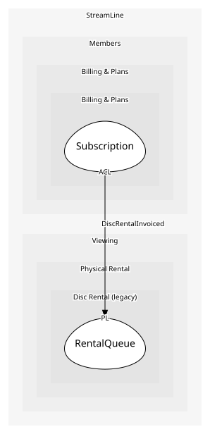

# RentalQueue
As far as anyone knows, the central table

## Entities and Value Objects
| Type | Name | Description | Attributes |
| --- | --- | --- | --- |
| Entity (Root) | **RentalQueue** | A member's ordered list of discs | **legacyAccountId**: `string` |

## Relationships

## Invariants
> No invariants.

## Provides
| Name | Type | Internal | Pattern | Description | Schema | Raises |
| --- | --- | --- | --- | --- | --- | --- |
| DiscRentalInvoiced | event | no | published-language | The monthly disc charge for a member | [DiscRentalInvoiced](../../index.md#schemas) | - |

## Consumes
> No consumptions.
	
