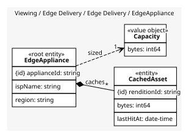
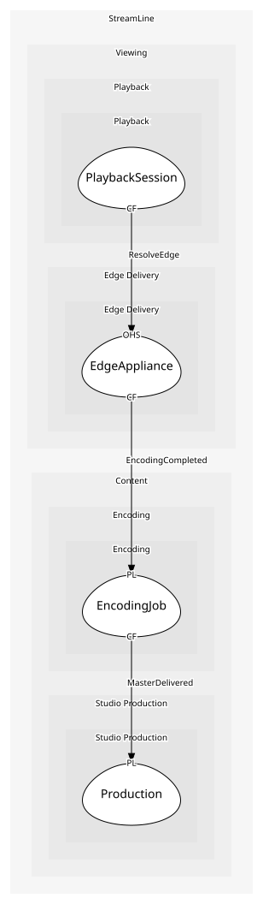

# EdgeAppliance
A cache box in an ISP and what it holds

## Entities and Value Objects
| Type | Name | Description | Attributes |
| --- | --- | --- | --- |
| Entity (Root) | **EdgeAppliance** | One box, one ISP, one region | **applianceId**: `string`, ispName: `string`, region: `string` |
| Entity | CachedAsset | One rendition on disk with its last hit time | **renditionId**: `string`, bytes: `int64`, lastHitAt: `date-time` |
| Value Object | Capacity | Disk bytes available for cache | bytes: `int64` |

## Relationships
| Source | Description | Target | Relation | Cardinality |
| --- | --- | --- | --- | --- |
| [EdgeAppliance](entities/edge_appliance/index.md) | caches | EdgeAppliance - CachedAsset | includes | * |
| [EdgeAppliance](entities/edge_appliance/index.md) | sized | EdgeAppliance - Capacity | uses | 1 |

## Invariants
| Name | Description | Constrains |
| --- | --- | --- |
| CachedBytesWithinCapacity | Cached bytes never exceed capacity; pre-positioning evicts | CachedAsset, Capacity |

## Provides
| Name | Type | Internal | Pattern | Description | Schema | Raises |
| --- | --- | --- | --- | --- | --- | --- |
| AssetPrepositioned | event | yes | - | A rendition was pushed to an appliance ahead of demand | - | - |
| ResolveEdge | operation | no | open-host-service | Which appliance a client should fetch from | [ResolveEdge](../../index.md#schemas) | - |
| PrepositionAsset | operation | yes | - | Push a rendition to appliances predicted to need it | - | AssetPrepositioned |

## Consumes

### EncodingCompleted [conformist]
All renditions are available
- **Provider**: [EncodingJob](../../../encoding/aggregates/encoding_job/index.md)

	
